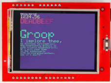
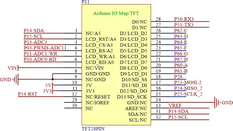
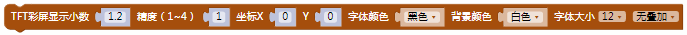
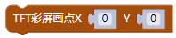
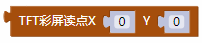
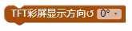
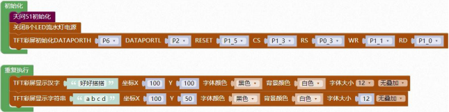

### TFT 彩屏模块<!-- {docsify-ignore} -->

 

**硬件概述**

 

  

 


> TFT（Thin Film Transistor）即薄膜场效应晶体管，它可以“主动地”对屏幕上的各个独立的像素进行控制，这样可以大大提高反应时间。一般 TFT 的反应时间比较快，约 80 毫秒， 而且可视角度大，一般可达到 130 度左右，主要运用在高端产品。从而可以做到高速度、高亮度、高对比度显示屏幕信息。TFT 属于有源矩阵液晶显示器，在技术上采用了“主动式矩阵” 的方式来驱动，方法是利用薄膜技术所作成的电晶体电极，利用扫描的方法“主动拉”控制任 意一个显示点的开与关，光源照射时先通过下偏光板向上透出，借助液晶分子传导光线，通过遮光和透光来达到显示的目的。
>


**电路原理图**

 


  

 


 

1. #### TFT 彩屏各引脚初始化

 


2. #### TFT 彩屏清屏并设置背景颜色

 


3. #### TFT 彩屏显示数字

 

> 彩屏显示数字，坐标、字体颜色、背景颜色、字体大小、有无叠加设置。
>


4. #### TFT 彩屏显示小数

 


5. #### TFT 彩屏显示字符串

 

> 彩屏显示字符串，坐标、字体颜色、背景颜色、字体大小、有无叠加设置。


6. #### TFT 彩屏显示汉字

 

> 彩屏显示汉字，坐标、字体颜色、背景颜色、字体大小、有无叠加设置。
>


7. #### TFT 彩屏颜色选择

 


8. #### TFT 彩屏设置画笔颜色

 


9. #### TFT 彩屏画点

 


10. #### TFT 彩屏读点

 


11. #### TFT 彩屏画线

 


12. #### TFT 彩屏填充

 


13. #### TFT 彩屏绘制矩形

 


14. #### TFT 彩屏画圆

 


15. #### TFT 彩屏绘制三角形

 


16. #### TFT 彩屏显示字符

 


17. #### TFT 彩屏设置显示方向

 


18. #### TFT 彩屏读取ID号

 


19. #### TFT 彩屏设置光标位置

  


20. #### TFT 彩屏设置显示窗口坐标

 


 

**示例代码 1**

> TFT 屏幕显示字符a b c d，和汉字好好搭搭。
>


 

 

 

**调用函数代码**


> 引入头文件

```c
#include "lib/tftlcd.h"
```


> 预定义 TFT 连接引脚，引脚预处理输入输出模式

```c
#define TFT_LCD_DATAPORTH P6//高 8 位数据口,8 位模式下只使用高 8 位
#define TFT_LCD_DATAPORTH_IN {P6M1=0xff;P6M0=0x00;}//P6 口高阻输入
#define TFT_LCD_DATAPORTH_OUT {P6M1=0x00;P6M0=0xff;}//P6 口推挽输出
#define TFT_LCD_DATAPORTL P2//低 8 位数据口,8 位模式下只使用高 8 位
#define TFT_LCD_RESET P1_5
#define TFT_LCD_RESET_OUT {P1M1&=~0x20;P1M0|=0x20;}//推挽输出
#define TFT_LCD_CS P1_3
#define TFT_LCD_CS_OUT {P1M1&=~0x08;P1M0|=0x08;}//推挽输出
#define TFT_LCD_RS P0_3
#define TFT_LCD_RS_OUT {P0M1&=~0x08;P0M0|=0x08;}//推挽输出
#define TFT_LCD_WR P1_1
#define TFT_LCD_WR_OUT {P1M1&=~0x02;P1M0|=0x02;}//推挽输出
#define TFT_LCD_RD P1_0
#define TFT_LCD_RD_OUT {P1M1&=~0x01;P1M0|=0x01;}//推挽输出

void tft_lcd_init(); //TFT 初始化，参数无
void tft_lcd_clear(uint16 color)//LCD 清屏函数，参数: color:清屏的颜色
uint16 tft_lcd_read_id(); //读取 ID 号
void tft_lcd_show_string(int16 x,int16 y,uint8 *p,uint16 font_color, uint16 backgrou
nd_color,uint8 size,uint8 mode) //在指定位置显示字符串.参数: x:起始 x 坐标; y:起始 y坐标; p:要显示的字符串; font_color:字符串的颜色值; background_color:背景色 size:显示字符的大小（12 或 16）; mode:0-无叠加，1-叠加.
    
void tft_lcd_show_font12(uint8 lenth, uint8 *hz, int16 x, int16 y,uint16 font_color, uint16 background_color, uint8 mode) //描述: 在指定位置显示 12*12 字体汉字.参数: hz:汉字的指针; x:起始 x 坐标; y:起始 y 坐标; lenth: 字体的总长度 font_color:显示字符的颜色值; background_color:显示字符的背景色;mode:0-无叠加，1-叠加.
    
void tft_lcd_show_font16(uint8 lenth, uint8 *hz, int16 x, int16 y,uint16 font_color, uint16 background_color, uint8 mode) // 在指定位置显示 16*16 字体汉字.参数: hz:汉字的指针; x:起始 x 坐标; y:起始 y 坐标; lenth: 字体的总长度 font_color:显示字符的颜色值; background_color:显示字符的背景色;mode:0-无叠加，1-叠加.
    
void tft_lcd_show_font24(uint8 lenth, uint8 *hz, int16 x, int16 y,uint16 font_color, uint16 background_color, uint8 mode) //在指定位置显示 24*24 字体汉字.参数: hz:汉字的指针; x:起始 x 坐标; y:起始 y 坐标; lenth: 字体的总长度 font_color:显示字符的颜色值; background_color:显示字符的背景色;mode:0-无叠加，1-叠加.
    
void tft_lcd_show_font32(uint8 lenth, uint8 *hz, int16 x, int16 y,uint16 font_color, uint16 background_color, uint8 mode)// 在指定位置显示 32*32 字体汉字，参数: hz:汉字的指针; x:起始 x 坐标; y:起始 y 坐标; lenth: 字体的总长度 font_color:显示字符的颜色值; background_color:显示字符的背景色;mode:0-无叠加，1-叠加.
    
void tft_lcd_draw_bmp16(uint16 x,uint16 y,uint16 w,uint16 h,const uint8*p) //显示16 位的 BMP 图像，参数: x0:起始 x 坐标; y0:起始 y 坐标;w:图片的宽度; h:图片的高度; p:图像数组的起始地址
```


 

**示例代码 1**

```c
#define TFT_LCD_DATAPORTH P6//高 8 位数据口,8 位模式下只使用高 8 位
#define TFT_LCD_DATAPORTH_IN {P6M1=0xff;P6M0=0x00;}//P6 口高阻输入
#define TFT_LCD_DATAPORTH_OUT {P6M1=0x00;P6M0=0xff;}//P6 口推挽输出
#define TFT_LCD_DATAPORTL P2//低 8 位数据口,8 位模式下只使用高 8 位
#define TFT_LCD_RESET P1_5
#define TFT_LCD_RESET_OUT {P1M1&=~0x20;P1M0|=0x20;}//推挽输出
#define TFT_LCD_CS P1_3
#define TFT_LCD_CS_OUT {P1M1&=~0x08;P1M0|=0x08;}//推挽输出
#define TFT_LCD_RS P0_3
#define TFT_LCD_RS_OUT {P0M1&=~0x08;P0M0|=0x08;}//推挽输出
#define TFT_LCD_WR P1_1
#define TFT_LCD_WR_OUT {P1M1&=~0x02;P1M0|=0x02;}//推挽输出
#define TFT_LCD_RD P1_0
#define TFT_LCD_RD_OUT {P1M1&=~0x01;P1M0|=0x01;}//推挽输出
#include <STC8HX.h>
uint32 sys_clk = 24000000;
//系统时钟确认

#include "lib/hc595.h"
#include "lib/rgb.h"
#include "lib/delay.h"
#include "lib/led8.h"
#include "lib/tftlcd.h"//引入 tftlcd 头文件

void twen_board_init()
{
    hc595_init();    //HC595 初始化
    hc595_disable(); //HC595 禁止点阵和数码管输出
    rgb_init();      //RGB 初始化
    delay(10);
    rgb_show(0, 0, 0, 0); //关闭 RGB
    delay(10);
}
void setup()
{
    twen_board_init(); //天问 51 初始化
    led8_disable();    //关闭 8 个 LED 流水灯电源
    tft_lcd_init();
}
void loop()
{
    tft_lcd_show_font12("好好搭搭", 100, 100, (TFT_LCD_BLACK), (TFT_LCD_WHITE), 0);
    //显示汉字 好好搭搭
    tft_lcd_show_string(100, 50, "a b c d", (TFT_LCD_BLACK), (TFT_LCD_WHITE), 12, 0);
    //显示字符串 a b c d
}
void main(void)
{
    setup();
    while (1)
    {
        loop();
    }
}

```

 