### 串口模块<!-- {docsify-ignore} -->

 

> STC8H 系列单片机具有 4 个全双工异步串行通信接口。每个串行口由 2 个数据缓冲器、一个移位 寄存器、一个串行控制寄存器和一个波特率发生器等组成。每个串行口的数据缓冲器由 2 个互相独立的接收、发送缓冲器构成，可以同时发送和接收数据。 STC8 系列单片机的串口 1 有 4 种工作方式，其中两种方式的波特率是可变的，另两种是固定的，以供不同应用场合选用。串口 2/串口 3/串口 4 都只有两种工作方式，这两种方式的波特率都是可变的。用户可用软件设置不同的波特率和选择不同的工作方式。主机可通过查询或中断方式对接收/发送进行程序处理，使用十分灵活。串口 1、串口 2、串口 3、串口 4 的通讯口均可以通过功能管脚的切换功能切换到多组端口，从而可以将一个通讯口分时复用为多个通讯口。
>

 

1. #### 串口引脚和波特率设置


 


```c
#include "lib/UART.h"//引用头文件
uart_init(UART_1, UART1_RX_P30, UART1_TX_P31, 9600, TIM_1);//初始化串口
```

引脚选择列表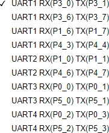 


> 波特率尽可能选用常用的 1200、2400、4800、9600、19200、38400、57600、115200， 和外部晶振有关，特殊波特率如果不能被整除，会导致波特率不准。图形化模块下拉框没有需要的波特率，可以自己添加数字模块后修改。
>


 

  

> 图形化模块默认初始化串口为模式 1 可变波特率 8 位数据方式。
>
> 串口 1，波特率采用定时器 1 来控制；
>
> 串口 2，波特率采用定时器 2 来控制； 
>
> 串口 3，波特率采用定时器 3 来控制； 
>
> 串口 4，波特率采用定时器 4 来控制。
>
> *使用的时候要注意不要和定时器冲突了*。

 

 （C51）

> C51主板串口初始化 波特率设置


2. #### 串口发送数据

 

```c
uart_putchar(UART_1, 0x31);//串口单个字符输出
```


 （C51）

> C51主板串口发送数据


3. #### 串口发送指定长度的数组数据


 

```c
uart_putbuff(UART_1, buff, 12);//数组输出
```

 

4. #### 串口发送字符串

 

```c
uart_putstr(UART_1, "haohaodada");//字符串输出
```

 

5. #### 读串口接收或发送中断请求标志位


  

```c
UART1_GET_RX_FLAG
```

> UART.H 文件里有如下宏定义：
>

```c
#define UART1_GET_RX_FLAG (SCON & 0x01)
#define UART2_GET_RX_FLAG (S2CON & 0x01)
#define UART3_GET_RX_FLAG (S3CON & 0x01)
#define UART4_GET_RX_FLAG (S4CON & 0x01)
#define UART1_GET_TX_FLAG (SCON & 0x02)
#define UART2_GET_TX_FLAG (S2CON & 0x02)
#define UART3_GET_TX_FLAG (S3CON & 0x02)
#define UART4_GET_TX_FLAG (S4CON & 0x02)
```

>  RI：串口 1 接收中断请求标志位。
>
>  TI：串口 1 发送中断请求标志位。


6. #### 清除串口接收或发送中断请求标志位

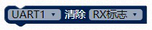 

```c
UART1_CLEAR_RX_FLAG 
```

UART.H 文件里有如下宏定义：

```c
#define UART1_CLEAR_RX_FLAG (SCON &= ~0x01)
#define UART2_CLEAR_RX_FLAG (S2CON &= ~0x01)
#define UART3_CLEAR_RX_FLAG (S3CON &= ~0x01)
#define UART4_CLEAR_RX_FLAG (S4CON &= ~0x01)

#define UART1_CLEAR_TX_FLAG (SCON &= ~0x02)
#define UART2_CLEAR_TX_FLAG (S2CON &= ~0x02)
#define UART3_CLEAR_TX_FLAG (S3CON &= ~0x02)
#define UART4_CLEAR_TX_FLAG (S4CON &= ~0x02)
```

 

7. #### 获取串口接收缓存数据


 

```c
SBUF
```

 （C51）

> C51主板串口接收数据


8. #### 设置串口中断，同时打开总中断

  

```c
EA = 1;
ES = 1;
```

 （C51）

>  C51主板串口设置中断设置


9. #### 串口接收中断函数

>
> 串口 1 中断号为 4；
>
> 串口 2 中断号为 8； 
>
> 串口 3 中断号为 17； 
>
> 串口 4 中断号为 18；
>


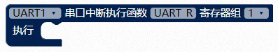 

 

```c
void UART_R(void) interrupt 4 using 1{
}
```

 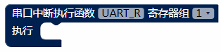 （C51）

> C51主板串口中断执行函数


10. #### 串口格式化打印输出


 

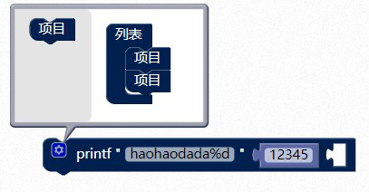 

 

> 如果要输出多个参数，可以点击蓝色齿轮，然后把左边的项目拖到列表里，就能多一个输入框，自己再拖入一个数字模块。
>

```c
printf_small("haohaodada%d", 12345, );	
```

> 因为 51 资源有限，使用的是剪裁版本的printf，功能不全，输出数据长度有限。
>

 

 （C51）

> C51主板串口打印输出


**printf 基本用法：**

> printf("Hello World!\n"); // \n 表示换行
>
> printf("%d\n", i); /*%d 是输出控制符，d 表示十进制，后面的 i 是输出参数*/.如果是%x 就是以十六进制的形式输出，要是%o 就是以八进制的形式输出 printf("i = %d, j = %d\n", i, j); i = 10, j = 3，输出多个数据。
>


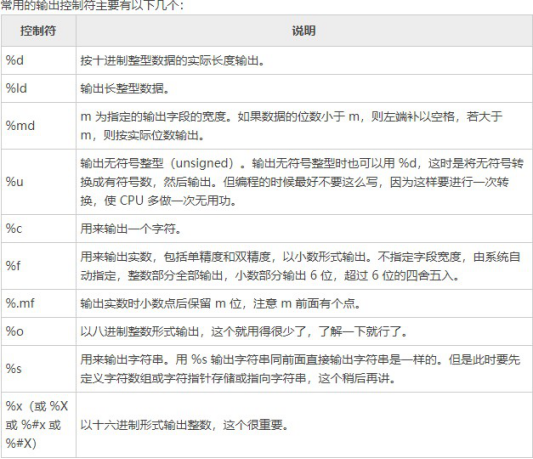 

> 更多用法，请查看C 语言相关知识。
>

> 示例 1：
>

> 串口 1 定时发送字符‘1’,对应的 ASSIC 码为 0x31。
>

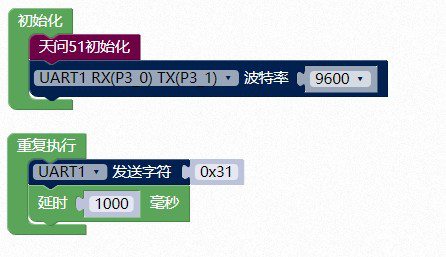 

```c
#include <STC8HX.h>
uint32 sys_clk = 24000000;
//系统时钟确认
#include "lib/hc595.h"
#include "lib/rgb.h"
#include "lib/delay.h"
#include "lib/UART.h"
void twen_board_init()
{
    P0M1=0x00;P0M0=0x00;//双向 IO 口
    P1M1=0x00;P1M0=0x00;//双向 IO 口
    P2M1=0x00;P2M0=0x00;//双向 IO 口
    P3M1=0x00;P3M0=0x00;//双向 IO 口
    P4M1=0x00;P4M0=0x00;//双向 IO 口
    P5M1=0x00;P5M0=0x00;//双向 IO 口
    P6M1=0x00;P6M0=0x00;//双向 IO 口
    P7M1=0x00;P7M0=0x00;//双向 IO 口
    hc595_init();//HC595 初始化
    hc595_disable();//HC595 禁止点阵和数码管输出
    rgb_init();//RGB 初始化
    delay(10);
    rgb_show(0,0,0,0);//关闭 RGB
    delay(10);
}
void setup()
{
    twen_board_init();//天问 51 初始化
    uart_init(UART_1, UART1_RX_P30, UART1_TX_P31, 9600, TIM_1);//初始化串口
}
void loop()
{
    uart_putchar(UART_1, 0x31);//串口单个字符输出
    delay(1000);
}
void main(void)
{
    setup();
    while(1){
    	loop();
    }
}

```

 

> 示例 2：
>

> 串口 1 定时发送数组，打开串口工具，可以看到输出字符“Hello”。
>


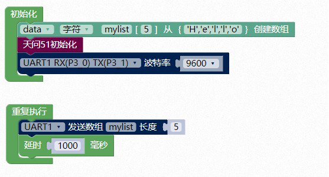 

 

```c
#include <STC8HX.h>
uint32 sys_clk = 24000000;
//系统时钟确认
#include "lib/hc595.h"
#include "lib/rgb.h"
#include "lib/delay.h"
#include "lib/UART.h"
char mylist[5]={'H','e','l','l','o'};
void twen_board_init()
{
    P0M1=0x00;P0M0=0x00;//双向 IO 口
    P1M1=0x00;P1M0=0x00;//双向 IO 口
    P2M1=0x00;P2M0=0x00;//双向 IO 口
    P3M1=0x00;P3M0=0x00;//双向 IO 口
    P4M1=0x00;P4M0=0x00;//双向 IO 口
    P5M1=0x00;P5M0=0x00;//双向 IO 口
    P6M1=0x00;P6M0=0x00;//双向 IO 口
    P7M1=0x00;P7M0=0x00;//双向 IO 口
    hc595_init();//HC595 初始化
    hc595_disable();//HC595 禁止点阵和数码管输出
    rgb_init();//RGB 初始化
    delay(10);
    rgb_show(0,0,0,0);//关闭 RGB
    delay(10);
}
void setup()
{
    twen_board_init();//天问 51 初始化
    uart_init(UART_1, UART1_RX_P30, UART1_TX_P31, 9600, TIM_1);//初始化串口
}
void loop()
{
    uart_putbuff(UART_1, mylist, 5);//数组输出
    delay(1000);
}
void main(void)
{
    setup();
    while(1){
    	loop();
    }
}
```


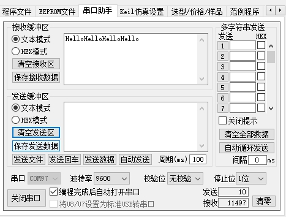 

 

> 示例 3：

> 串口 1 定时发送字符串，打开串口工具，可以看到输出字符“haohaodada”。
>


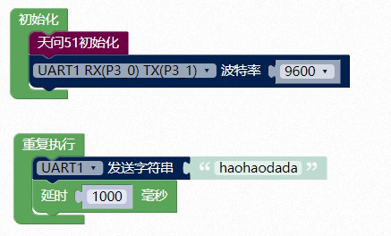 

```c
#include <STC8HX.h>
uint32 sys_clk = 24000000;
//系统时钟确认
#include "lib/hc595.h"
#include "lib/rgb.h"
#include "lib/delay.h"
#include "lib/UART.h"
void twen_board_init()
{
    P0M1=0x00;P0M0=0x00;//双向 IO 口
    P1M1=0x00;P1M0=0x00;//双向 IO 口
    P2M1=0x00;P2M0=0x00;//双向 IO 口
    P3M1=0x00;P3M0=0x00;//双向 IO 口
    P4M1=0x00;P4M0=0x00;//双向 IO 口
    P5M1=0x00;P5M0=0x00;//双向 IO 口
    P6M1=0x00;P6M0=0x00;//双向 IO 口
    P7M1=0x00;P7M0=0x00;//双向 IO 口
    hc595_init();//HC595 初始化
    hc595_disable();//HC595 禁止点阵和数码管输出
    rgb_init();//RGB 初始化
    delay(10);
    rgb_show(0,0,0,0);//关闭 RGB
    delay(10);
}
void setup()
{
    twen_board_init();//天问 51 初始化
    uart_init(UART_1, UART1_RX_P30, UART1_TX_P31, 9600, TIM_1);//初始化串口
}
void loop()
{
    uart_putstr(UART_1, "haohaodada");//字符串输出
    delay(1000);
}
void main(void)
{
    setup();
    while(1){
    	loop();
    }
}
```


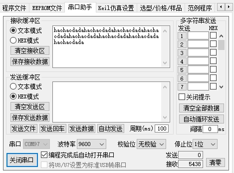 

 

> 示例 4：
>

> 串口 1 采用查询方式，读取接收数据，这种方式，当循环里任务多的时候，容易丢失数据。打开串口工具，我们发送文本 2，会自动回复文本 1。
>


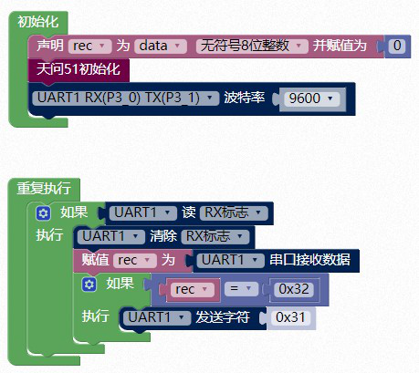 


```c
#include <STC8HX.h>
uint32 sys_clk = 24000000;
//系统时钟确认
#include "lib/hc595.h"
#include "lib/rgb.h"
#include "lib/delay.h"
#include "lib/UART.h"
uint8 rec = 0;
void twen_board_init()
{
    P0M1=0x00;P0M0=0x00;//双向 IO 口
    P1M1=0x00;P1M0=0x00;//双向 IO 口
    P2M1=0x00;P2M0=0x00;//双向 IO 口
    P3M1=0x00;P3M0=0x00;//双向 IO 口
    P4M1=0x00;P4M0=0x00;//双向 IO 口
    P5M1=0x00;P5M0=0x00;//双向 IO 口
    P6M1=0x00;P6M0=0x00;//双向 IO 口
    P7M1=0x00;P7M0=0x00;//双向 IO 口
    hc595_init();//HC595 初始化
    hc595_disable();//HC595 禁止点阵和数码管输出
    rgb_init();//RGB 初始化
    delay(10);
    rgb_show(0,0,0,0);//关闭 RGB
    delay(10);
}
void setup()
{
    twen_board_init();//天问 51 初始化
    uart_init(UART_1, UART1_RX_P30, UART1_TX_P31, 9600, TIM_1);//初始化串口
}
void loop()
{
    if(UART1_GET_RX_FLAG){
        UART1_CLEAR_RX_FLAG;
        rec = SBUF;
        if(rec == 0x32){
        	uart_putchar(UART_1, 0x31);//串口单个字符输出
        }
    }
}
void main(void)
{
    setup();
    while(1){
    	loop();
    }
}

```

 

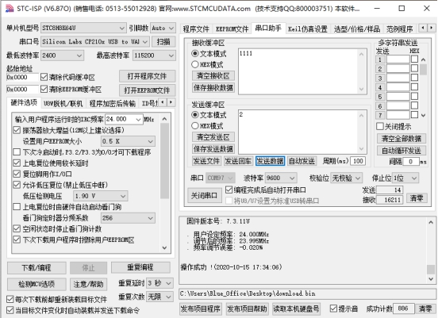 

 

> 示例 5：
>

> 串口 1 采用中断方式，读取接受数据。打开串口工具，我们发送十六进制 32，会自动回复十六进制 31。
>

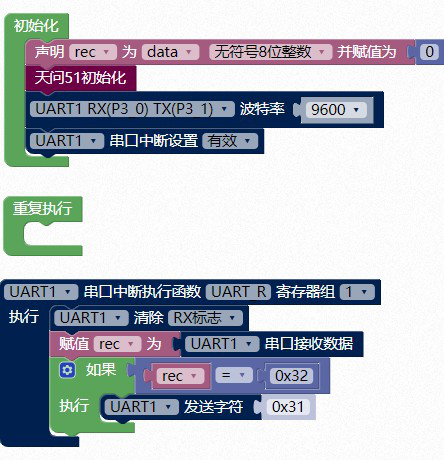  


```c
#include <STC8HX.h>
uint32 sys_clk = 24000000;
//系统时钟确认
#include "lib/hc595.h"
#include "lib/rgb.h"
#include "lib/delay.h"
#include "lib/UART.h"
uint8 rec = 0;
void twen_board_init()
{
    P0M1=0x00;P0M0=0x00;//双向 IO 口
    P1M1=0x00;P1M0=0x00;//双向 IO 口
    P2M1=0x00;P2M0=0x00;//双向 IO 口
    P3M1=0x00;P3M0=0x00;//双向 IO 口
    P4M1=0x00;P4M0=0x00;//双向 IO 口
    P5M1=0x00;P5M0=0x00;//双向 IO 口
    P6M1=0x00;P6M0=0x00;//双向 IO 口
    P7M1=0x00;P7M0=0x00;//双向 IO 口
    hc595_init();//HC595 初始化
    hc595_disable();//HC595 禁止点阵和数码管输出
    rgb_init();//RGB 初始化
    delay(10);
    rgb_show(0,0,0,0);//关闭 RGB
    delay(10);
}
void UART_R(void) interrupt 4 using 1{
    UART1_CLEAR_RX_FLAG;
    rec = SBUF;
    if(rec == 0x32){
    	uart_putchar(UART_1, 0x31);//串口单个字符输出
    }
}
void setup()
{
    twen_board_init();//天问 51 初始化
    uart_init(UART_1, UART1_RX_P30, UART1_TX_P31, 9600, TIM_1);//初始化串口
    EA = 1;
    ES = 1;
}
void loop()
{
    
}
void main(void)
{
    setup();
    while(1){
    	loop();
    }
}
```

 

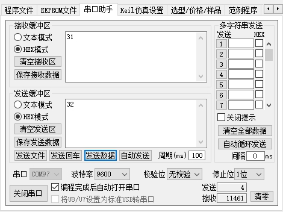 

 

> 在串口模块里还有更多选项，里面是一些直接读写寄存器的模块，供高级应用。
>

 

11. #### 读串口的TI、RI或REN 寄存器。


 

```c
REN //UART1
S2CON & 0x10 // UART2,不能位寻址
S3CON & 0x10 // UART3,不能位寻址
S4CON & 0x10 // UART4,不能位寻址
```


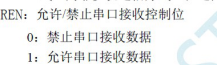 

 

```c
TI //UART1
S2CON & 0x02 // UART2,不能位寻址
S3CON & 0x02 // UART3,不能位寻址
S4CON & 0x02 // UART4,不能位寻址
```

```c
RI //UART1
S2CON & 0x01 // UART2,不能位寻址
S3CON & 0x01 // UART3,不能位寻址
S4CON & 0x01 // UART4,不能位寻址
```

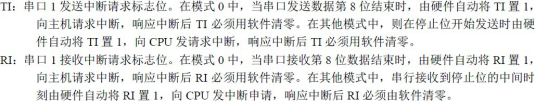 

 

12. #### 写串口的TI、RI或REN 寄存器值


 


```c
REN = 1; //UART1
S2CON |= 0x10; // UART2,不能位寻址
S3CON |= 0x10; // UART3,不能位寻址
S4CON |= 0x10; // UART4,不能位寻址

TI = 1; //UART1
S2CON |= 0x02; // UART2,不能位寻址
S3CON |= 0x02; // UART3,不能位寻址
S4CON |= 0x02; // UART4,不能位寻址

RI = 1; //UART1
S2CON |= 0x01; // UART2,不能位寻址
S3CON |= 0x01; // UART3,不能位寻址
S4CON |= 0x01; // UART4,不能位寻址
```

 

13. #### 读 PCON 电源管理寄存器


 

```c
PCON	
```

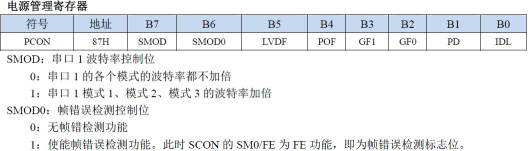 

 

14. #### 写 PCON 电源管理寄存器值


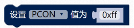 

```c
PCON = 0xff;
```

 

15. #### 读 SCON 电源管理寄存器


 

```c
SCON //UART1
S2CON //UART2
S3CON //UART3
S4CON //UART4
```


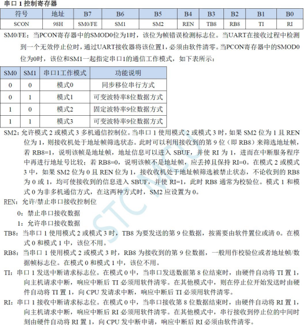 

 

16. #### 写 SCON 电源管理寄存器值


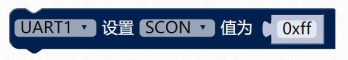 

```c
SCON = 0xff; //UART1 
S2CON = 0xff; //UART2 
S3CON = 0xff; //UART3
S4CON = 0xff; //UART4	
```

