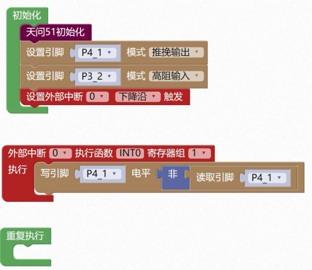

### 外部中断模块<!-- {docsify-ignore} -->

 

> STC8H 外部中断有 5 个 INT0 到 INT4，天问 51 开发板上的 INT0 为 P32 连接到了独立按键KEY1，INT1 为 P33 连接到了独立按键KEY2，INT2 为 P36 连接到了红外接收引脚，INT3为 P37 连接到了加速度传感器的中断引脚，INT4 为P30 连接到了 USB 接口的D-。
>


 

 


> 通过手册提供的中断结构图，我们可以看到配置 INT0，先要设置 IT0 寄存器，IT0=0 为引脚上的电平从低电平变为高电平，或者从高电平变为低电平时，即电平变化就会触发中断； IT0=1 为引脚上的电平从高电平变为低电平时，即下降沿就会触发中断。然后设置 EX0 允许中断，和 EA 总中断控制。中断优先级我们暂时不设置，默认为最低优先级。
>

 

1. #### 设置外部中断


 

> 这里需要注意，只有外部中断 INT0、INT1 有电平变化和下降沿两种状态，INT2、INT3、INT4 只有下降沿。
>

```c
IT0 = 0;
EX0 = 1;
EA = 1; 
```

 

 

 

 

 

2. #### 外部中断函数

 

```c
void INT0(void) interrupt 0 using 1{
    
} 
void INT1(void) interrupt 2 using 1{
    
}
void INT2(void) interrupt 10 using 1{
    
}
void INT3(void) interrupt 11 using 1{
    
}
void INT4(void) interrupt 16 using 1{
    
}
```

> 示例 1：
>

> 设置按键KEY1 下降沿中断，控制P41 LED 灯翻转。
>


 

 

```c
#include <STC8HX.h>
uint32 sys_clk = 24000000;
//系统时钟确认
#include "lib/hc595.h"
#include "lib/rgb.h"
#include "lib/delay.h"
void twen_board_init()
{
    P0M1 = 0x00;
    P0M0 = 0x00; //双向 IO 口
    P1M1 = 0x00;
    P1M0 = 0x00; //双向 IO 口
    P2M1 = 0x00;
    P2M0 = 0x00; //双向 IO 口
    P3M1 = 0x00;
    P3M0 = 0x00; //双向 IO 口
    P4M1 = 0x00;
    P4M0 = 0x00; //双向 IO 口
    P5M1 = 0x00;
    P5M0 = 0x00; //双向 IO 口
    P6M1 = 0x00;
    P6M0 = 0x00; //双向 IO 口
    P7M1 = 0x00;
    P7M0 = 0x00;     //双向 IO 口
    hc595_init();    //HC595 初始化
    hc595_disable(); //HC595 禁止点阵和数码管输出
    rgb_init();      //RGB 初始化
    delay(10);
    rgb_show(0, 0, 0, 0); //关闭 RGB
    delay(10);
}
void INT0(void) interrupt 0 using 1
{
    P4_1 = !P4_1;
}
void setup()
{
    twen_board_init(); //天问 51 初始化
    P4M1 &= ~0x02;
    P4M0 |= 0x02; //推挽输出
    P3M1 |= 0x04;
    P3M0 &= ~0x04; //高阻输入
    IT0 = 1;
    EX0 = 1;
    EA = 1;
}
void loop()
{
    
}
void main(void)
{
    setup();
    while (1)
    {
        loop();
    }
}
```


 

3. #### 读外部中断请求标志

 


4. #### 清除外部中断请求标志

 

 