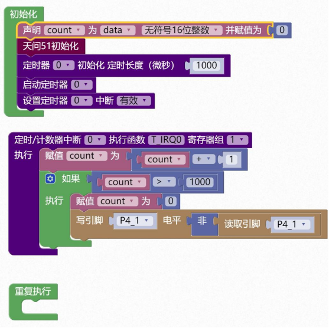

### 定时器模块<!-- {docsify-ignore} -->

> ​		STC8H 系列单片机内部设置了 5 个 16 位定时器/计数器。5 个 16 位定时器 T0、T1、T2、T3 和 T4 都具有计数方式和定时方式两种工作方式。对定时器/计数器 T0 和 T1，用它们在特殊功能寄存器 TMOD 中相对应的控制位 C/T 来选择 T0 或 T1 为定时器还是计数器。对定时器/计数器 T2，用特殊功能寄存器 AUXR 中的控制位 T2_C/T 来选择T2 为定时器还是计数器。对定时器/计数器 T3，用特殊功能寄存器 T4T3M 中的控制位 T3_C/T 来选择 T3 为定时器还是计数器。对定时器/计数器 T4，用特殊功能寄存器T4T3M 中的控制位 T4_C/T 来选择T4 为定时器还是计数器。定时器/计数器的核心部件是一个加法计数器，其本质是对脉冲进行计数。只是计数脉冲来源不同：如果计数脉冲来自系统时钟，则为定时方式，此时定时器/计数器每 12 个时钟或者每 1 个时钟得到一个计数脉冲，计数值加 1；如果计数脉冲来自单片机外部引脚，则为计数方式，每来一个脉冲加 1。
>
> ​		当定时器/计数器 T0、T1 及 T2 工作在定时模式时，特殊功能寄存器 AUXR 中的 T0x12、T1x12 和T2x12 分别决定是系统时钟/12 还是系统时钟/1（不分频）后让 T0、T1 和T2 进行计数。当定时器/计数器 T3 和 T4 工作在定时模式时，特殊功能寄存器 T4T3M 中的T3x12 和T4x12 分别决定是系统时钟/12 还是系统时钟/1（不分频）后让 T3 和 T4 进行计数。当定时器/计数器工作在计数模式时，对外部脉冲计数不分频。
>
> ​		定时器/计数器 0 有 4 种工作模式：模式 0（16 位自动重装载模式），模式 1（16 位不可重装载模式），模式 2（8 位自动重装模式），模式 3（不可屏蔽中断的 16 位自动重装载模式）。定时器/计数器 1 除模式 3 外，其他工作模式与定时器/计数器 0 相同。T1 在模式 3 时无效，停止计数。定时器 T2 的工作模式固定为 16 位自动重装载模式。T2 可以当定时器使用，也可以当串口的波特率发生器和可编程时钟输出。定时器 3、定时器 4 与定时器 T2 一样，它们的工作模式固定为 16 位自动重装载模式。T3/T4 可以当定时器使用，也可以当串口的波特率发生器和可编程时钟输出。
>

 

1. #### 定时器初始化设置

> 图形化模块默认为模式 0（16 位自动重装载模式）

  

```c
  AUXR &= 0x7f;		//定时器时钟12T模式
  TMOD &= 0xf0;		//设置定时器模式
  TL0 = 0x38;		//设定定时初值
  TH0 = 0xff;		//设定定时初值
```

 


2. #### 启动定时器

设置TRn 寄存器为 1。

 

```c
TR0 = 1;// 启动定时器	
```

 


3. #### 停止定时器

设置TRn 寄存器为 0。

 

```c
TR0 = 0;// 停止定时器 
```


4. #### 设置定时器的中断开关

 

```c
EA = 1; // 控制总中断 
ET0 = 1; // 控制定时器中断
```


5. #### 定时器中断函数

> 定时器用的中断号为 1，寄存器组默认使用 1。

 

```c
void T_IRQ0(void) interrupt 1 using 1{ 

}
```

> 示例 1：
>
> 定时器 0，配置为 16 位自动重载模式，周期为 1 毫秒，打开中断，中断里每隔 1 秒反转一次引脚状态，现象为 P41 上的LED，一秒亮，一秒灭。

 

 

```
#include <STC8HX.h>
uint32 sys_clk = 24000000;
//系统时钟确认
#include "lib/hc595.h"
#include "lib/rgb.h"
#include "lib/delay.h"
uint16 count = 0;
void twen_board_init()
{
    P0M1=0x00;P0M0=0x00;//双向 IO 口
    P1M1=0x00;P1M0=0x00;//双向 IO 口
    P2M1=0x00;P2M0=0x00;//双向 IO 口
    P3M1=0x00;P3M0=0x00;//双向 IO 口
    P4M1=0x00;P4M0=0x00;//双向 IO 口
    P5M1=0x00;P5M0=0x00;//双向 IO 口
    P6M1=0x00;P6M0=0x00;//双向 IO 口
    P7M1=0x00;P7M0=0x00;//双向 IO 口
    hc595_init();//HC595 初始化
    hc595_disable();//HC595 禁止点阵和数码管输出
    rgb_init();//RGB 初始化
    delay(10);
    rgb_show(0,0,0,0);//关闭 RGB
    delay(10);
}
void Timer0Init(void) //1000 微秒@24.000MHz
{
    TMOD |= 0x00; //模式 0
    TL0 = 0x2f; //设定定时初值
    TH0 = 0xf8; //设定定时初值
}
void T_IRQ0(void) interrupt 1 using 1{
    count = count + 1;
    if(count > 1000){
        count = 0;
        P4_1 = !P4_1;
    }
}
void setup()
{
    twen_board_init();//天问 51 初始化
    Timer0Init();
    TR0 = 1;// 启动定时器
    EA = 1; // 控制总中断
    ET0 = 1; // 控制定时器中断
}
void loop()
{

}
void main(void)
{
    setup();
    while(1){
    	loop();
    }
}

```

> 定时器模块还有更多选项，里面是一些直接读写寄存器的模块，供高级应用。
>

 


6. #### 读定时器溢出标志 

> 读取TFn 寄存器数值。

 

```c
TF0
```

 


7. #### 清除定时器溢出标志

> 设置TFn 寄存器数值为 0。

 

```c
TF0 = 0;
```

 


8. #### 读定时器计数寄存器 TLn或THn 数值


 

```c
TL0
```

 


9. #### 设置定时器计数寄存器TLn或THn数值

 

```c
TL0 = 0xff;
```


10. #### 读定时器模式寄存器TMOD或控制寄存器TCON数值


 

```c
TMOD
```

 


11. #### 设置定时器模式寄存器TMOD或控制寄存器TCON数值


 

```c
TMOD = 0xff;
```