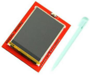
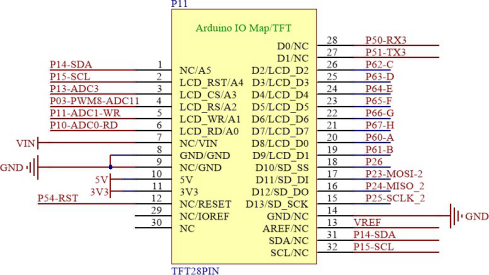
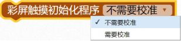
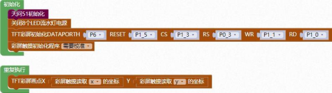

### 彩屏触摸<!-- {docsify-ignore} -->

 

**概述**

 

 

 


触摸屏（Touch Panel）又称为“触控屏”、“[触控面板](https://baike.baidu.com/item/触控面板/290223)”，是一种可接收触头等输入讯号的感应式液晶显示装置，当接触了屏幕上的图形按钮时，屏幕上的触觉[反馈系统](https://baike.baidu.com/item/反馈系统/8371296)可根据预先编程的程式驱动各种连结装置，可用以取代机械式的按钮面板，并借由液晶显示画面制造出生动的影音效果。

触摸屏作为一种最新的电脑输入设备，它是简单、方便、自然的一种人机交互方式。它赋予了多媒体以崭新的面貌，是极富吸引力的全新多媒体交互设备。主要应用于公共信息的查询、工业控制、军事指挥、电子游戏、多媒体教学等

 

**电路原理图**

 


 

 


 

 

1. #### 彩屏触摸初始化

 

> 彩屏触摸初始化程序，选择是否需要校准。


2. #### 彩屏触摸读取AD值

 


3. #### 彩屏触摸刷新数据

 


4. #### 彩屏触摸读取坐标

 

> 彩屏触摸读取X or Y 的坐标。
>


5. #### 彩屏触摸读取压力值

 

 

 

**示例代码 1**


 

> 彩屏初始化校准，然后可以进行触摸画点。
>


**调用函数代码**

>  引入头文件


```c
#include "lib/touch.h"
void touch_init(uint8 t);
//触摸初始化程序，参数: t:0,不进入校准程序;其他值:进入校准程序

uint16 touch_read_x(); //读取 x 校准过的坐标
uint16 touch_read_y(); //读取 y 校准过的坐标
uint16 touch_read_pressure(); //读取触摸的压力值.
```


**示例代码 1**

```c
#define TFT_LCD_DATAPORTH P6//高 8 位数据口,8 位模式下只使用高 8 位
#define TFT_LCD_DATAPORTH_IN {P6M1=0xff;P6M0=0x00;}//P6 口高阻输入
#define TFT_LCD_DATAPORTH_OUT {P6M1=0x00;P6M0=0xff;}//P6 口推挽输出
#define TFT_LCD_DATAPORTL P2//低 8 位数据口,8 位模式下只使用高 8 位
#define TFT_LCD_RESET P1_5
#define TFT_LCD_RESET_OUT {P1M1&=~0x20;P1M0|=0x20;}//推挽输出
#define TFT_LCD_CS P1_3
#define TFT_LCD_CS_OUT {P1M1&=~0x08;P1M0|=0x08;}//推挽输出
#define TFT_LCD_RS P0_3
#define TFT_LCD_RS_OUT {P0M1&=~0x08;P0M0|=0x08;}//推挽输出
#define TFT_LCD_WR P1_1
#define TFT_LCD_WR_OUT {P1M1&=~0x02;P1M0|=0x02;}//推挽输出
#define TFT_LCD_RD P1_0
#define TFT_LCD_RD_OUT {P1M1&=~0x01;P1M0|=0x01;}//推挽输出
#include <STC8HX.h>
uint32 sys_clk = 24000000;
//系统时钟确认

#include "lib/hc595.h"
#include "lib/rgb.h"
#include "lib/delay.h"
#include "lib/led8.h"
#include "lib/tftlcd.h"
#include "lib/touch.h"

void twen_board_init()
{
    hc595_init();    //HC595 初始化
    hc595_disable(); //HC595 禁止点阵和数码管输出
    rgb_init();      //RGB 初始化
    delay(10);
    rgb_show(0, 0, 0, 0); //关闭 RGB
    delay(10);
}
void setup()
{
    twen_board_init(); //天问 51 初始化
    led8_disable();    //关闭 8 个 LED 流水灯电源
    tft_lcd_init();
    touch_init(1); //彩屏触摸初始化程序
}
void loop()
{
    tft_lcd_draw_point((touch_read_x()), (touch_read_y())); //画点
}
void main(void)
{
    setup();
    while (1)
    {
        loop();
    }
}
```

