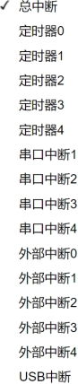

### 所有中断设置模块<!-- {docsify-ignore} -->

 

> 这部分使用频率比较低，相比于前面单独的外部中断、定时器中断、串口中断，还多了
>
> USB 中断，提供给高级用户使用。
>

 

 

1. #### 设置对应中断状态

 

2. #### 读对应中断状态

 

 

3. #### 对应的中断执行函数

 

 （STC32G）

 （STC32G）

 