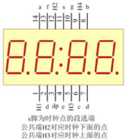

#### 数码管模块<!-- {docsify-ignore} -->

 

**硬件概述**


 

 

> 共阳数码管是指将所有发光二极管的阳极接到一起，形成公共阳极（COM）的数码管， 共阳数码管在应用的时候，应该将COM 端口接到正极，当某一段发光二极管的阴极为低电平的时候，相对应的段就点亮，当某一字段的阴极为高电平的时候，相对应段就不亮。
>

 

**引脚定义**

 

 

 


 

| 序号                                               | 符号                              | 管脚名 | 功 能 描 述 |
| ------------------------------------------------------------ | ------------------------------------------- | ---------------- | --------------------- |
| 1、12、5，9                                        | H1、H2、H3、H4                    | COM              | 公共端口              |
| 14、8、6、2 和 7、4、13、10、3 | a、b、c、d、e、f、g、dp | 段码             | 0-7 段数码管段选端口  |
| 11                                                 | s                                 | 段选端           | 时钟的段选端          |

 

**数码管内部连线图**


 

 

**电路原理图**


 

 

1. #### 数码管初始化

 

> 初始化数码管和左右冒号相对应端口。
>


2. #### 数码管扫描回调函数

 


3. #### 数码管显示整数

 


4. #### 数码管显示浮点数

 


5. #### 设置数码管显示时间和显示的位置

 


6. #### 数码管显示时间

 

> 数码管显示时分秒


7. #### 数码管清屏

 

> 数码管清屏函数
>


8. #### 数码管清除位

 


9. #### 数码管更新显示缓存

 


10. #### 数码管设置指定位小数点状态

 


 

**示例代码 1**

> 八位数码管显示整数 1~8。
>


 

 


**示例代码 2**

> 数码管显示浮点数 3.1415，精度设置 4 位。
>


 

 


**示例代码 3**


 

数码管设置时间为 12：30，设置在右侧显示。


 

**示例代码 4**

```c
//段码
//0,1,2,3,4,5,6,7,8,9,A,B,C,D,E,F,-,NONE
code uint8 _nix_seg[18]={0xC0,0xF9,0xA4,0xB0,0x99,0x92,0x82,0xF8,0x80,0
x90,0x88,0x83,0xC6,0xA1,0x86,0x8E,0xBF,0xFF};
//显示缓存
xdata uint8 _nix_display_buff[8]={17,17,17,17,17,17,17,17};

```

> 数码管的驱动库，内部定义了 0-F 等 18 个常用码，和一个 8 字节的显示缓存。如果需要数码管显示特定数据，我们只需要更新显示缓存的显示码。
>
> 自定义缓存数据为 0，1，2，3，11，12，13，16，显示的数据为 0，1，2，3，b，c，d，-。数码管更新显示数据从 mylist 数组中调取。
>


 

 


 **调用函数代码**

> 引入头文件

```c
#include "lib/nixietube.h"
```


> 预定义数码管、左侧数码管冒号、右侧数码管冒号的连接引脚，引脚预处理输出

```c
#define NIXIETUBE_PORT P6//数码管输出端口
#define NIXIETUBE_PORT_MODE {P6M1=0x00;P6M0=0xff;}//推挽输出
#define NIXIETUBE_LEFT_COLON_PIN P0_7//左侧数码管冒号
#define NIXIETUBE_LEFT_COLON_PIN_MODE {P0M1&=~0x80;P0M0|=0x80;}//推挽
输出
#define NIXIETUBE_RIGHT_COLON_PIN P2_1//右侧数码管冒号
#define NIXIETUBE_RIGHT_COLON_PIN_MODE {P2M1&=~0x02;P2M0|=0x02;}//推
挽输出

void nix_init()//数码管显示初始化，参数无
    
void nix_scan_callback()//数码管扫描回调函数，参数无
    
void nix_display_num(int32 num) //数码管显示整数函数，参数：(-9999999~99999999)

void nix_display_float(float num, uint8 precision)
//数码管显示浮点数函数，参数：浮点数，精度(1,2,3,4)
  
    
void nix_display_time(uint8 hour,uint8 minute,uint8 dir)    
//数码管显示时间函数，参数：小时，分，0：左侧；1：右侧
    
void nix_display_clear()//数码管清屏，参数无    
    
void nix_display_update_buf(uint8 *buf)
//数码管显示更新显示缓存数据函数，参数：缓存地址    
    
void nix_display_clear_bit(uint8 nbit) //数码管清除指定位函数，参数（0~7)    
    
void nix_display_time2(uint8 hour,uint8 minute,uint8 second)
//数码管显示时间， 参数 时，分，秒      
```


 

**示例代码 1**

```c
#define NIXIETUBE_PORT P6//数码管输出端口
#define NIXIETUBE_PORT_MODE {P6M1=0x00;P6M0=0xff;}//推挽输出
#define NIXIETUBE_LEFT_COLON_PIN P0_7//左侧数码管冒号
#define NIXIETUBE_LEFT_COLON_PIN_MODE {P0M1&=~0x80;P0M0|=0x80;}//推挽
输出
#define NIXIETUBE_RIGHT_COLON_PIN P2_1//右侧数码管冒号
#define NIXIETUBE_RIGHT_COLON_PIN_MODE {P2M1&=~0x02;P2M0|=0x02;}//推
挽输出
#include <STC8HX.h>
uint32 sys_clk = 24000000;
//系统时钟确认
#include "lib/hc595.h"
#include "lib/rgb.h"
#include "lib/delay.h"
#include "lib/led8.h"
#include "lib/nixietube.h"//引用 数码管 头文件
void twen_board_init()
{
    hc595_init();//HC595 初始化
    hc595_disable();//HC595 禁止点阵和数码管输出
    rgb_init();//RGB 初始化
    delay(10);
    rgb_show(0,0,0,0);//关闭 RGB
    delay(10);
}
void setup()
{
    twen_board_init();//天问 51 初始化
    led8_disable();//关闭 8 个 LED 流水灯电源
    nix_init();//数码管初始化
}
void loop()
{
    nix_scan_callback();//数码管扫描回调函数
    nix_display_num(12345678);//数码管显示整数 12345678
    delay(1);
}
void main(void)
{
    setup();
    while(1){
        loop();
    }
}
```

 


**示例代码 2**

 

```c
#define NIXIETUBE_PORT P6//数码管输出端口
#define NIXIETUBE_PORT_MODE {P6M1=0x00;P6M0=0xff;}//推挽输出
#define NIXIETUBE_LEFT_COLON_PIN P0_7//左侧数码管冒号
#define NIXIETUBE_LEFT_COLON_PIN_MODE {P0M1&=~0x80;P0M0|=0x80;}//推挽
输出
#define NIXIETUBE_RIGHT_COLON_PIN P2_1//右侧数码管冒号
#define NIXIETUBE_RIGHT_COLON_PIN_MODE {P2M1&=~0x02;P2M0|=0x02;}//推
挽输出
#include <STC8HX.h>
uint32 sys_clk = 24000000;
//系统时钟确认
#include "lib/hc595.h"
#include "lib/rgb.h"
#include "lib/delay.h"
#include "lib/led8.h"
#include "lib/nixietube.h"//引用 数码管 头文件
void twen_board_init()
{
    hc595_init();//HC595 初始化
    hc595_disable();//HC595 禁止点阵和数码管输出
    rgb_init();//RGB 初始化
    delay(10);
    rgb_show(0,0,0,0);//关闭 RGB
    delay(10);
}
void setup()
{
    twen_board_init();//天问 51 初始化
    led8_disable();//关闭 8 个 LED 流水灯电源
    nix_init();//数码管初始化
}
void loop()
{
    nix_scan_callback();//数码管扫描回调函数
    nix_display_float(3.1415,4);//数码管显示浮点数 3.1415，4 位精度
    delay(1);
}
void main(void)
{
    setup();
    while(1){
    	loop();
    }
}
```

 


**示例代码 3**

 

```c
#define NIXIETUBE_PORT P6 //数码管输出端口
#define NIXIETUBE_PORT_MODE{P6M1=0x00;P6M0=0xff;}//推挽输出                             
#define NIXIETUBE_LEFT_COLON_PIN P0_7 //左侧数码管冒号
#define NIXIETUBE_LEFT_COLON_PIN_MODE {P0M1&=~0x80;P0M0|=0x80;}//推挽
#define NIXIETUBE_RIGHT_COLON_PIN P2_1 //右侧数码管冒号
#define NIXIETUBE_RIGHT_COLON_PIN_MODE {P2M1&=~0x02;P2M0|=0x02;}//推挽输出
#include <STC8HX.h>
uint32 sys_clk = 24000000;
//系统时钟确认
#include "lib/hc595.h"
#include "lib/rgb.h"
#include "lib/delay.h"
#include "lib/led8.h"
#include "lib/nixietube.h" //引用 数码管 头文件
void twen_board_init()
{
    hc595_init();    //HC595 初始化
    hc595_disable(); //HC595 禁止点阵和数码管输出
    rgb_init();      //RGB 初始化
    delay(10);
    rgb_show(0, 0, 0, 0); //关闭 RGB
    delay(10);
}
void Timer0Init(void) //1000 微秒@24.000MHz
{
    TMOD |= 0x00; //模式 0
    TL0 = 0x2f;   //设定定时初值
    TH0 = 0xf8;   //设定定时初值
}
void T_IRQ0(void) interrupt 1 using 1
{
    nix_scan_callback(); //数码管扫描回调函数
}
void setup()
{
    twen_board_init(); //天问 51 初始化
    led8_disable();    //关闭 8 个 LED 流水灯电源
    nix_init();        //数码管初始化
    Timer0Init();
    EA = 1;  // 控制总中断
    ET0 = 1; // 控制定时器中断
    TR0 = 1; // 启动定时器
}
void loop()
{
    nix_display_clear();         //数码管清屏
    nix_display_time(12, 30, 1); //数码管显示时间 12：30，右侧显示
    delay(2000);
}
void main(void)
{
    setup();
    while (1)
    {
        loop();
    }
}
```


 


 

**示例代码 4**


```c
#define NIXIETUBE_PORT P6//数码管输出端口
#define NIXIETUBE_PORT_MODE {P6M1=0x00;P6M0=0xff;}//推挽输出
#define NIXIETUBE_LEFT_COLON_PIN P0_7//左侧数码管冒号
#define NIXIETUBE_LEFT_COLON_PIN_MODE {P0M1&=~0x80;P0M0|=0x80;}//推挽输出
#define NIXIETUBE_RIGHT_COLON_PIN P2_1//右侧数码管冒号
#define NIXIETUBE_RIGHT_COLON_PIN_MODE {P2M1&=~0x02;P2M0|=0x02;}//推挽输出

#include <STC8HX.h>
uint32 sys_clk = 24000000;
//系统时钟确认
#include "lib/hc595.h"
#include "lib/rgb.h"
#include "lib/delay.h"
#include "lib/led8.h"
#include "lib/nixietube.h"                      //引用 数码管 头文件
uint8 mylist[8] = {16, 13, 12, 11, 3, 2, 1, 0}; //自定义数组
void twen_board_init()
{
    hc595_init();    //HC595 初始化
    hc595_disable(); //HC595 禁止点阵和数码管输出
    rgb_init();      //RGB 初始化
    delay(10);
    rgb_show(0, 0, 0, 0); //关闭 RGB
    delay(10);
}
void Timer0Init(void) //1000 微秒@24.000MHz
{
    TMOD |= 0x00; //模式 0
    TL0 = 0x2f;   //设定定时初值
    TH0 = 0xf8;   //设定定时初值
}
void T_IRQ0(void) interrupt 1 using 1
{
    nix_scan_callback(); //数码管扫描回调函数
}
void setup()
{
    twen_board_init(); //天问 51 初始化
    led8_disable();    //关闭 8 个 LED 流水灯电源
    nix_init();        //数码管初始化
    Timer0Init();
    EA = 1;  // 控制总中断
    ET0 = 1; // 控制定时器中断
    TR0 = 1; // 启动定时器
}
void loop()
{
    nix_display_clear();            //数码管清屏
    nix_display_update_buf(mylist); //数码管更新显示缓存 0,1,2,a,b,c,-
    delay(1000);
}
void main(void)
{
    setup();
    while (1)
    {
        loop();
    }
}
```


