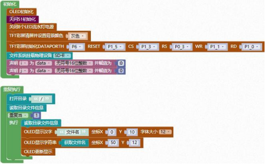

### 文件系统<!-- {docsify-ignore} -->


1. #### 文件操作返回状态

 


2. #### 返回值选取

 

 

3. #### 文件系统挂载物理设备选择

 


4. #### 打开目录

 


5. #### 读取目录信息

 


6. #### 获取文件名

 


7. #### 打开文件

 


8. #### 写文件数据长度到write_buf

 


9. #### 读取文件数据长度到 read_buf

 


10. #### 获取实际读取/写入数据长度

 


11. #### 设置读取文件指针偏移量

 


**示例代码 1**

> 读取 SD 卡文件系统，并用 OLED 显示文件名字（注：需要先在 SD 卡内放置文件才能够读取，否则 SD 卡内文件为空，无法读取）。

 


**示例代码 1**

```c
#define TFT_LCD_DATAPORTH P6//高 8 位数据口,8 位模式下只使用高 8 位
#define TFT_LCD_DATAPORTH_IN {P6M1=0xff;P6M0=0x00;}//P6 口高阻输入
#define TFT_LCD_DATAPORTH_OUT {P6M1=0x00;P6M0=0xff;}//P6 口推挽输出
#define TFT_LCD_DATAPORTL P2//低 8 位数据口,8 位模式下只使用高 8 位
#define TFT_LCD_RESET P1_5
#define TFT_LCD_RESET_OUT {P1M1&=~0x20;P1M0|=0x20;}//推挽输出
#define TFT_LCD_CS P1_3
#define TFT_LCD_CS_OUT {P1M1&=~0x08;P1M0|=0x08;}//推挽输出
#define TFT_LCD_RS P0_3
#define TFT_LCD_RS_OUT {P0M1&=~0x08;P0M0|=0x08;}//推挽输出
#define TFT_LCD_WR P1_1
#define TFT_LCD_WR_OUT {P1M1&=~0x02;P1M0|=0x02;}//推挽输出
#define TFT_LCD_RD P1_0
#define TFT_LCD_RD_OUT {P1M1&=~0x01;P1M0|=0x01;}//推挽输出

#include <STC8HX.h>
uint32 sys_clk = 24000000;
// 系统时钟确认
#include "lib/oled.h"
#include "lib/hc595.h"
#include "lib/rgb.h"
#include "lib/delay.h"
#include "lib/led8.h"
#include "lib/tftlcd.h"
#include "lib/pff.h" //引入 文件系统 头文件
FRESULT res;
FATFS xdata g_fatfs;

uint16 i = 0;
uint16 j = 0;
DIR dir;
FILINFO fileinfo;
void twen_board_init()
{
    hc595_init();    // HC595 初始化
    hc595_disable(); // HC595 禁止点阵和数码管输出
    rgb_init();      // RGB 初始化
    delay(10);
    rgb_show(0, 0, 0, 0); // 关闭 RGB
    delay(10);
}
void setup()
{
    oled_init();       // OLED 初始化
    twen_board_init(); // 天问 51 初始化
    led8_disable();    // 关闭 8 个 LED 流水灯电源
    tft_lcd_clear((TFT_LCD_GRAY));
    tft_lcd_init();

    res = pf_mount(&g_fatfs);
}
void loop()
{
    res = pf_opendir(&dir, "/");
    res = pf_readdir(&dir, &fileinfo);
    while (1)
    {
        res = pf_readdir(&dir, &fileinfo);
        oled_show_font12("文件名", 0, 10);
        oled_show_string(50, 12, (fileinfo.fname)); // 显示文件名字
        oled_display();                             // OLED 更新显示
    }
}
void main(void)
{
    setup();
    while (1)
    {
        loop();
    }
}
```


