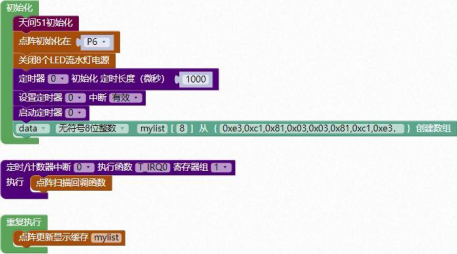

#### 点阵模块<!-- {docsify-ignore} -->

**硬件概述**


 

 

> LED 点阵模块指的是利用封装 8*8 的模块组合点元板形成模块，它连接微处理器与 8 位数字的 7 段数字 LED 显示，也可以连接条线图显示器或者 64 个独立的 LED。其上包括一个片上的 B 型BCD 编码器、多路扫描回路，段字驱动器，而且还有一个 8*8 的静态RAM 用来存储每一个数据。只有一个外部寄存器用来设置各个 LED 的段电流。每个数据可以寻址在更新时不需要改写所有的显示。LED 点阵显示模块可显示汉字、图形、动画及英文字符等;显示方式有静态、横向滚动、垂直滚动和翻页显示等。
>

 

**引脚定义**

 

 

 

| 序号 | 符号                                  | 管脚名 | 功 能 描 述 |
| -------------- | ----------------------------------------------- | ---------------- | --------------------- |
| 1    | 1、2、5、7、8、9、12、14              | COM    | 公共正极              |
| 2    | 3、4、6、10、11、13、15、16 | 负极   | 电源负极              |


**点阵内部连线图**

 

 

 

 

**电路原理图**


 

 


 

 

图形化模块

 

1. #### 点阵初始化


 

> 点阵初始化在P6 端口。
>


2. #### 点阵扫描回调函数


 


3. #### 点阵显示点

 

> 设置点阵在第几行，第几列显示点。


4. #### 点阵清除点

 

> 设置点阵在第几行，第几列清除点。


5. #### 点阵显示字符串


 


6. #### 点阵显示数字

 


7. #### 点阵显示小数

 


8. #### 点阵显示图案

 


9. #### 设置点阵显示自带图案

 


10. #### 点阵更新显示缓存

 


11. #### 点阵清屏

 


**示例代码 1**

> 设置点阵在第 0 行，第 0 列显示一个点。
>


 

 

 

**示例代码 2**


 

> 设置点阵显示数字 123。
>


 

 

**示例代码 3**

> 设置点阵显示字符串 abcd。
>


 

 

 

**示例代码 4**


 

> 设置点阵显示大爱心，300 毫秒后切换小爱心，依次循环。
>


 

**示例代码 5**

> 显示自定义图案，设置数组数据 0xe3,0xc1,0x81,0x03,0x03,0x81,0xc1,0xe3，点阵更新显示数据从 mylist 数组中调用数据。
>


 

 

 

 

**调用函数代码**

> 引入头文件

```c
#include "lib/matrix.h"
```


> 预定义点阵连接引脚，引脚预处理输出

```c
#define MATRIX_PORT P6//点阵的引脚
#define MATRIX_PORT_MODE {P6M1=0x00;P6M0=0xff;}//推挽输出

void matrix_init()//点阵屏初始化，参数无
    
void matrix_scan_callback()
//点阵屏扫描回调函数，(需要在 1ms 定时器中断函数里调用总周期 16ms<视觉 20ms)，参数无
    
matrix_set_pixel(uint8 x,uint8 y,uint8 state)
//点阵屏设置指定点亮灭状态
// 参数: x 坐标（0-7），y 坐标（0-7），1：亮；0：灭.
// (0,7)-------(7,7)    
//  |            |
//  |            |
//  |            |
// (0,0)-------(7,0)
void matrix_clear()//点阵屏清屏，参数无
    
void matrix_update_buf(uint8 *from) //点阵屏显示缓存更新数据，参数:子模数组指针
    
void matrix_display_string(uint8 *chr);// 点阵屏显示字符，参数: 字符

void matrix_display_num(int16 value);//点阵显示数字，参数：数字    
```


**示例代码 1**

```c
#define MATRIX_PORT P6//点阵的引脚
#define MATRIX_PORT_MODE {P6M1=0x00;P6M0=0xff;}//推挽输出
#include <STC8HX.h>
uint32 sys_clk = 24000000;
//系统时钟确认
#include "lib/hc595.h"
#include "lib/rgb.h"
#include "lib/delay.h"
#include "lib/matrix.h"//引用 点阵 头文件
#include "lib/led8.h"

void twen_board_init()
{
    hc595_init();    //HC595 初始化
    hc595_disable(); //HC595 禁止点阵和数码管输出
    rgb_init();      //RGB 初始化
    delay(10);
    rgb_show(0, 0, 0, 0); //关闭 RGB
    delay(10);
}
void setup()
{
    twen_board_init(); //天问 51 初始化
    matrix_init();     //点阵初始化
    led8_disable();    //关闭 8 个 LED 流水灯电源
}
void loop()
{
    matrix_scan_callback();    //点阵扫描回调函数
    matrix_set_pixel(0, 0, 1); //点阵屏设置第一个点状态亮
}
void main(void)
{
    setup();
    while (1)
    {
        loop();
    }
}
```


**示例代码 2**

```c
#define MATRIX_PORT P6//点阵的引脚
#define MATRIX_PORT_MODE {P6M1=0x00;P6M0=0xff;}//推挽输出
#include <STC8HX.h>
uint32 sys_clk = 24000000;
//系统时钟确认
#include "lib/hc595.h"
#include "lib/rgb.h"
#include "lib/delay.h"
#include "lib/matrix.h"//调用 点阵 头文件
#include "lib/led8.h"
#include "lib/oled.h"

void twen_board_init()
{
    hc595_init();    //HC595 初始化
    hc595_disable(); //HC595 禁止点阵和数码管输出
    rgb_init();      //RGB 初始化
    delay(10);
    rgb_show(0, 0, 0, 0); //关闭 RGB
    delay(10);
}
void Timer0Init(void) //1000 微秒@24.000MHz
{
    TMOD |= 0x00; //模式 0
    TL0 = 0x2f;   //设定定时初值
    TH0 = 0xf8;   //设定定时初值
}
void T_IRQ0(void) interrupt 1 using 1
{
    matrix_scan_callback(); //点阵扫描回调函数
}

void setup()
{
    twen_board_init(); //天问 51 初始化
    matrix_init();     //点阵初始化
    led8_disable();    //关闭 8 个 LED 流水灯电源
    Timer0Init();
    EA = 1;  // 控制总中断
    ET0 = 1; // 控制定时器中断
    TR0 = 1; // 启动定时器
}
void loop()
{
    matrix_display_num(123); //点阵显示数字 123
}
void main(void)
{
    setup();
    while (1)
    {
        loop();
    }
}
```


**示例代码 3**

```c
#define MATRIX_PORT P6//点阵的引脚
#define MATRIX_PORT_MODE {P6M1=0x00;P6M0=0xff;}//推挽输出
#include <STC8HX.h>
uint32 sys_clk = 24000000;
//系统时钟确认
#include "lib/hc595.h"
#include "lib/rgb.h"
#include "lib/delay.h"
#include "lib/matrix.h"//引用 点阵 头文件
#include "lib/led8.h"
#include "lib/oled.h"

void twen_board_init()
{
    hc595_init();    //HC595 初始化
    hc595_disable(); //HC595 禁止点阵和数码管输出
    rgb_init();      //RGB 初始化
    delay(10);
    rgb_show(0, 0, 0, 0); //关闭 RGB
    delay(10);
}
void Timer0Init(void) //1000 微秒@24.000MHz
{
    TMOD |= 0x00; //模式 0
    TL0 = 0x2f;   //设定定时初值
    TH0 = 0xf8;   //设定定时初值
}
void T_IRQ0(void) interrupt 1 using 1
{
    matrix_scan_callback(); //点阵扫描回调函数
}
void setup()
{
    twen_board_init(); //天问 51 初始化
    matrix_init();     //点阵初始化
    led8_disable();    //关闭 8 个 LED 流水灯电源
    Timer0Init();
    EA = 1;  // 控制总中断
    ET0 = 1; // 控制定时器中断
    TR0 = 1; // 启动定时器
}
void loop()
{
    matrix_display_string("abcd"); //点阵显示字符 abcd
}
void main(void)
{
    setup();
    while (1)
    {
        loop();
    }
}
```


**示例代码 4**

```c
#define MATRIX_PORT P6//点阵的引脚
#define MATRIX_PORT_MODE {P6M1=0x00;P6M0=0xff;}//推挽输出
#include <STC8HX.h>
uint32 sys_clk = 24000000;
//系统时钟确认
#include "lib/hc595.h"
#include "lib/rgb.h"
#include "lib/delay.h"
#include "lib/matrix.h"//引用 点阵 头文件
#include "lib/led8.h"

void twen_board_init()
{
    hc595_init();    //HC595 初始化
    hc595_disable(); //HC595 禁止点阵和数码管输出
    rgb_init();      //RGB 初始化
    delay(10);
    rgb_show(0, 0, 0, 0); //关闭 RGB
    delay(10);
}
void Timer0Init(void) //1000 微秒@24.000MHz
{
    TMOD |= 0x00; //模式 0
    TL0 = 0x2f;   //设定定时初值
    TH0 = 0xf8;   //设定定时初值
}
void T_IRQ0(void) interrupt 1 using 1
{
    matrix_scan_callback(); //点阵扫描回调函数
}
uint8_t matrix[8];
void setup()
{
    twen_board_init(); //天问 51 初始化
    matrix_init();     //点阵初始化
    led8_disable();    //关闭 8 个 LED 流水灯电源
    Timer0Init();
    EA = 1;  // 控制总中断
    ET0 = 1; // 控制定时器中断
    TR0 = 1; // 启动定时器
}
void loop()
{
    matrix[0] = 0xe3;
    matrix[1] = 0xc1;
    matrix[2] = 0x81;
    matrix[3] = 0x03;
    matrix[4] = 0x03;
    matrix[5] = 0x81;
    matrix[6] = 0xc1;
    matrix[7] = 0xe3;
    matrix_update_buf(matrix); //点阵屏显示缓存更新数据
    delay(300);
    matrix[0] = 0xff;
    matrix[1] = 0xe7;
    matrix[2] = 0xc3;
    matrix[3] = 0x87;
    matrix[4] = 0x87;
    matrix[5] = 0xc3;
    matrix[6] = 0xe7;
    matrix[7] = 0xff;
    matrix_update_buf(matrix); //点阵屏显示缓存更新数据
    delay(300);
}
void main(void)
{
    setup();
    while (1)
    {
        loop();
    }
}
```


**示例代码 5**

```c
#define MATRIX_PORT P6//点阵的引脚
#define MATRIX_PORT_MODE {P6M1=0x00;P6M0=0xff;}//推挽输出
#include <STC8HX.h>
uint32 sys_clk = 24000000;
//系统时钟确认
#include "lib/hc595.h"
#include "lib/rgb.h"
#include "lib/delay.h"
#include "lib/matrix.h"//引用 点阵 头文件
#include "lib/led8.h"
uint8 mylist[8]={0xe3,0xc1,0x81,0x03,0x03,0x81,0xc1,0xe3，};//自定义数组

void twen_board_init()
{
    hc595_init();    //HC595 初始化
    hc595_disable(); //HC595 禁止点阵和数码管输出
    rgb_init();      //RGB 初始化
    delay(10);
    rgb_show(0, 0, 0, 0); //关闭 RGB
    delay(10);
}
void Timer0Init(void) //1000 微秒@24.000MHz
{
    TMOD |= 0x00; //模式 0
    TL0 = 0x2f;   //设定定时初值
    TH0 = 0xf8;   //设定定时初值
}
void T_IRQ0(void) interrupt 1 using 1
{
    matrix_scan_callback(); //点阵扫描回调函数
}
void setup()
{
    twen_board_init(); //天问 51 初始化
    matrix_init();     //点阵初始化
    led8_disable();    //关闭 8 个 LED 流水灯电源
    Timer0Init();
    EA = 1;  // 控制总中断
    ET0 = 1; // 控制定时器中断
    TR0 = 1; // 启动定时器
}
void loop()
{
    matrix_update_buf(mylist); //点阵更新显示自定义数组缓存数据
}
void main(void)
{
    setup();
    while (1)
    {
        loop();
    }
}
```

