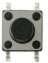
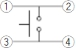
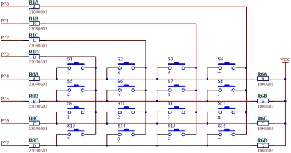
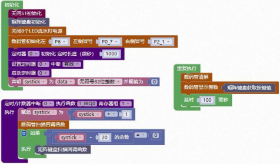

### 矩阵键盘模块<!-- {docsify-ignore} -->

 

**硬件概述**

 


> ​	矩阵键盘是[单片机](https://baike.baidu.com/item/单片机/102396)外部设备中所使用的排布类似于矩阵的键盘组。矩阵式结构的键盘显然比直接法要复杂一些，识别也要复杂一些，列线通过电阻接正电源，并将行线所接的单片机的 I/O 口作为输出端，而列线所接的 I/O 口则作为输入。
>

> ​	在键盘中按键数量较多时，为了减少 I/O 口的占用，通常将按键排列成[矩阵](https://baike.baidu.com/item/矩阵)形式。在矩阵式键盘中，每条水平线和垂直线在交叉处不直接连通，而是通过一个按键加以连接。这样， 一个端口（如 P7 口）就可以构成 4*4=16 个按键，比之直接将端口线用于键盘多出了一倍， 而且线数越多，区别越明显，比如再多加一条线就可以构成 20 键的键盘，而直接用端口线则只能多出一键（9 键）。由此可见，在需要的键数比较多时，采用矩阵法来做键盘是合理的。
>

 

**引脚定义**

 

 

 

| 序号 | 符号 | 功 能 描 述 |
| -------------- | -------------- | --------------------- |
| 1    | ①    | 与②脚相连             |
| 2    | ②    | 与①脚相连             |
| 3    | ③    | 与④脚相连             |
| 4    | ④    | 与③脚相连             |

**电路原理图**

 

 

1. #### 矩阵键盘初始化

 


2. #### 矩阵键盘获取按键值

 


3. #### 矩阵键盘扫描回调函数

 


**示例代码 1**

> 数码管显示矩阵键盘按键值。
>

 


 **调用函数代码**

> 引入头文件

```c
#include "lib/keypad.h"
```

```c
void keypad_init()//矩阵键盘初始化函数，参数无
int8 keypad_get_value();//获取按键值，参数无
void io_key_scan(); //按键扫描函数，参数无
```

**示例代码 1**

```c
#define NIXIETUBE_PORT P6
#define NIXIETUBE_PORT_MODE {P6M1=0x00;P6M0=0xff;}//推挽输出
#define NIXIETUBE_LEFT_COLON_PIN P0_7//左侧数码管冒号
#define NIXIETUBE_LEFT_COLON_PIN_MODE {P0M1&=~0x80;P0M0|=0x80;}//推挽输出
#define NIXIETUBE_RIGHT_COLON_PIN P2_1//右侧数码管冒号
#define NIXIETUBE_RIGHT_COLON_PIN_MODE {P2M1&=~0x02;P2M0|=0x02;}//推挽输出

#include <STC8HX.h>
uint32 sys_clk = 24000000;
//系统时钟确认
#include "lib/hc595.h"
#include "lib/rgb.h"
#include "lib/delay.h"
#include "lib/keypad.h"//引用 矩阵按键 头文件
#include "lib/led8.h"
#include "lib/nixietube.h"

uint32 systick = 0;
void twen_board_init()
{
    hc595_init();    // HC595 初始化
    hc595_disable(); // HC595 禁止点阵和数码管输出
    rgb_init();      // RGB 初始化
    delay(10);
    rgb_show(0, 0, 0, 0); // 关闭 RGB
    delay(10);
}
void Timer0Init(void) // 1000 微秒@24.000MHz
{
    TMOD |= 0x00; // 模式 0
    TL0 = 0x2f;   // 设定定时初值

    TH0 = 0xf8; // 设定定时初值
}
void T_IRQ0(void) interrupt 1 using 1
{
    systick = systick + 1;
    nix_scan_callback(); // 数码管扫描回调函数
    if (systick % 20 == 0)
    {
        io_key_scan(); // 矩阵键盘扫描回调函数
    }
}
void setup()
{
    twen_board_init(); // 天问 51 初始化
    keypad_init();
    led8_disable(); // 关闭 8 个 LED 流水灯电源
    nix_init();     // 数码管初始化
    Timer0Init();
    EA = 1;  // 控制总中断
    ET0 = 1; // 控制定时器中断
    TR0 = 1; // 启动定时器
}

void loop()
{
    nix_display_clear();                   // 数码管清屏
    nix_display_num((keypad_get_value())); // 数码管显示按键值
    delay(100);
}
void main(void)
{
    setup();
    while (1)
    {
        loop();
    }
}
```

