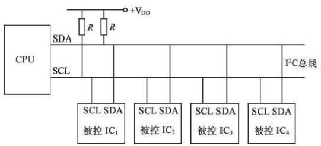
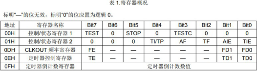
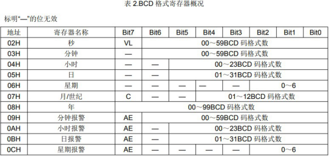
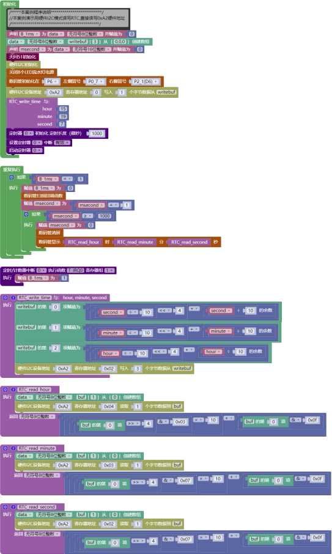

## I2C 模块<!-- {docsify-ignore} -->

### 硬件I2C <!-- {docsify-ignore} -->

**硬件概述**

> ​	I2C 总线是由Philips 公司开发的一种简单、双向二线制同步串行总线。它只需要两根线即可在连接于总线上的器件之间传送信息。
>

> ​	主器件用于启动总线传送数据，并产生时钟以开放传送的器件，此时任何被寻址的器件均被认为是从器件．在总线上主和从、发和收的关系不是恒定的，而取决于此时数据传送方向。如果主机要发送数据给从器件，则主机首先寻址从器件，然后主动发送数据至从器件，最后由主机终止数据传送；如果主机要接收从器件的数据，首先由主器件寻址从器件．然后主机接收从器件发送的数据，最后由主机终止接收过程。在这种情况下．主机负责产生定时时钟和终止数据传送。
>

 

**引脚定义**

> 图形化库默认使用P14、P15 两个硬件 I2C 引脚，使用代码编程可以自定义选择引脚。
>

| 序号 | 符号 | 管脚名 | 功 能 描 述 |
| -------------- | -------------- | ---------------- | --------------------- |
| 1              | SDA            | P14              | 串行数据线            |
| 2              | SCL            | P15              | 串行时钟线            |

**电路原理图**

 


> I2C 库目前只支持主机模式。
>

1. #### 硬件I2C 初始化


 


2. #### 硬件I2C 读数据

 

3. #### 硬件I2C 写数据

 


4. ####  软件I2C 初始化

 


5. #### 软件I2C 读数据

 


6. #### 软件I2C 写数据

 


**示例代码 1**

> 用硬件 I2C 读取和设置RTC 时钟芯片寄存器数据。
>


 

 


 


**调用函数代码**

> //引入头文件

```c
#include "lib/hardiic.h"
```

> //定义引脚

```c
#define HARDIIC_IICX 0x80 //将 IIC 设置为 P1_5,P1_4
#define HARDIIC_SCL_OUT {P1M1|=0x20;P1M0|=0x20;} //开漏输出
#define HARDIIC_SDA_OUT {P1M1|=0x10;P1M0|=0x10;} //开漏输出

void hardiic_init();//引脚 I2C 初始化
void hardiic_read_nbyte(uint8 device_addr, uint8 reg_addr, uint8 *p, ui
nt8 number);//硬件 I2C 读字节数据
void hardiic_write_nbyte(uint8 device_addr, uint8 reg_addr, uint8 *p, u
int8 number);//硬件 I2C 写字节数据
```

**示例代码 1**

```c
#define HARDIIC_IICX 0x80 //将 IIC 设置为 P1_5,P1_4
#define HARDIIC_SCL_OUT {P1M1|=0x20;P1M0|=0x20;} //开漏输出
#define HARDIIC_SDA_OUT {P1M1|=0x10;P1M0|=0x10;} //开漏输出
#define NIXIETUBE_PORT P6
#define NIXIETUBE_PORT_MODE {P6M1=0x00;P6M0=0xff;}//推挽输出
#define NIXIETUBE_LEFT_COLON_PIN P0_7//左侧数码管冒号
#define NIXIETUBE_LEFT_COLON_PIN_MODE {P0M1&=~0x80;P0M0|=0x80;}//推挽输出
#define NIXIETUBE_RIGHT_COLON_PIN P2_1//右侧数码管冒号
#define NIXIETUBE_RIGHT_COLON_PIN_MODE {P2M1&=~0x02;P2M0|=0x02;}//推挽输出
#include <STC8HX.h>
uint32 sys_clk = 24000000;
//系统时钟确认
#include "lib/hc595.h"
#include "lib/rgb.h"
#include "lib/delay.h"
#include "lib/hardiic.h"
#include "lib/led8.h"
#include "lib/nixietube.h"

uint8 B_1ms = 0;
uint16 msecond = 0;
void RTC_write_time(uint8 hour, uint8 minute, uint8 second);
uint8 RTC_read_hour();
uint8 RTC_read_minute();
uint8 RTC_read_second();

uint8 writebuf[3] = {0, 0, 0};
void twen_board_init()
{
    P0M1 = 0x00;
    P0M0 = 0x00; // 双向 IO 口
    P1M1 = 0x00;
    P1M0 = 0x00; // 双向 IO 口
    P2M1 = 0x00;
    P2M0 = 0x00; // 双向 IO 口
    P3M1 = 0x00;
    P3M0 = 0x00; // 双向 IO 口
    P4M1 = 0x00;
    P4M0 = 0x00; // 双向 IO 口
    P5M1 = 0x00;
    P5M0 = 0x00; // 双向 IO 口
    P6M1 = 0x00;
    P6M0 = 0x00; // 双向 IO 口
    P7M1 = 0x00;
    P7M0 = 0x00;     // 双向 IO 口
    hc595_init();    // HC595 初始化
    hc595_disable(); // HC595 禁止点阵和数码管输出
    rgb_init();      // RGB 初始化
    delay(10);
    rgb_show(0, 0, 0, 0); // 关闭 RGB
    delay(10);
}
void Timer0Init(void) // 1000 微秒@24.000MHz
{
    TMOD |= 0x00; // 模式 0
    TL0 = 0x2f;   // 设定定时初值
    TH0 = 0xf8;   // 设定定时初值
}
void T_IRQ0(void) interrupt 1 using 1
{
    B_1ms = 1;
}
/*描述该功能...
 */
void RTC_write_time(uint8 hour, uint8 minute, uint8 second)
{
    writebuf[(int)(0)] = ((second / 10) << 4) + second % 10;
    writebuf[(int)(1)] = ((minute / 10) << 4) + minute % 10;
    writebuf[(int)(2)] = ((hour / 10) << 4) + hour % 10;
    hardiic_write_nbyte(0xA2, 0x02, writebuf, 3); // I2C 写入 n 个字节数据
}
uint8 buf[1] = {0};
/*描述该功能...
 */
uint8 RTC_read_hour()
{

    hardiic_read_nbyte(0xA2, 0x04, buf, 1); // I2C 读取 n 个字节数据
    return ((buf[(int)(0)] >> 4) & 0x03) * 10 + (buf[(int)(0)] & 0x0f);
}
/*描述该功能...
 */
uint8 RTC_read_minute()
{
    hardiic_read_nbyte(0xA2, 0x03, buf, 1); // I2C 读取 n 个字节数据
    return ((buf[(int)(0)] >> 4) & 0x07) * 10 + (buf[(int)(0)] & 0x0f);
}
/*描述该功能...
 */
uint8 RTC_read_second()
{
    hardiic_read_nbyte(0xA2, 0x02, buf, 1); // I2C 读取 n 个字节数据
    return ((buf[(int)(0)] >> 4) & 0x07) * 10 + (buf[(int)(0)] & 0x0f);
}
void setup()
{
    /*****本案例程序说明**************************/
    // 本案例演示用硬件 I2C 模式读写 RTC,直接读写 0xA2 硬件地址
    /*********************************************/
    twen_board_init(); // 天问 51 初始化
    hardiic_init();
    led8_disable();                            // 关闭 8 个 LED 流水灯电源
    nix_init();                                // 数码管初始化
    hardiic_write_nbyte(0xA2, 0, writebuf, 1); // I2C 写入 n 个字节数据
    RTC_write_time(15, 19, 7);
    Timer0Init();
    EA = 1;  // 控制总中断
    ET0 = 1; // 控制定时器中断
    TR0 = 1; // 启动定时器
}
void loop()
{
    if (B_1ms == 1)
    {
        B_1ms = 0;
        nix_scan_callback(); // 数码管扫描回调函数
        msecond = msecond + 1;
        if (msecond >= 1000)
        {
            msecond = 0;
            nix_display_clear(); // 数码管清屏

            nix_display_time2((RTC_read_hour()), (RTC_read_minute()), (RTC_read _second())); // 数码管显示时间
        }
    }
}
void main(void)
{
    setup();
    while (1)
    {
        loop();
    }
}

```

