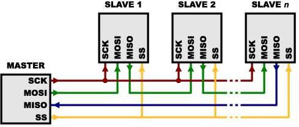
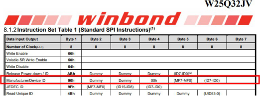
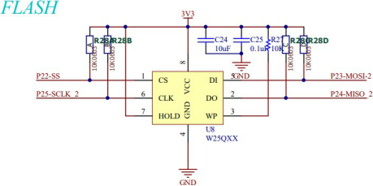
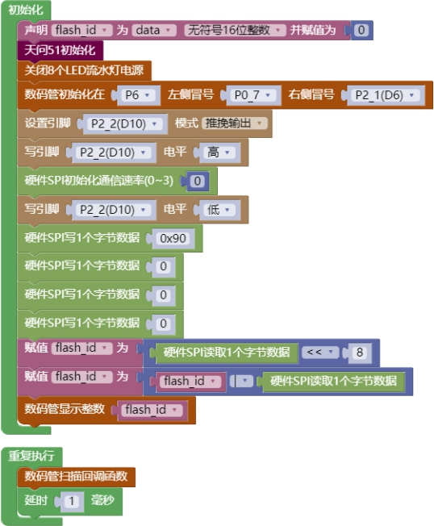

## SPI 模块<!-- {docsify-ignore} -->

### 硬件 SPI <!-- {docsify-ignore} -->

**硬件概述**

> ​	SPI 是由摩托罗拉(Motorola)公司开发的全双工同步串行总线，是微处理控制单元(MCU)和外围设备之间进行通信的同步串行端口。主要应用在 EEPROM、Flash、实时时钟(RTC)、数模转换器(ADC)、网络控制器、MCU、数字信号处理器(DSP)以及数字信号解码器之间。SPI系统可直接与各个厂家生产的多种标准外围器件直接接口，一般使用 4 条线:串行时钟线SCK、主机输人/从机输出数据线 MISO、主机输出/从机输人数据线 MOSI 和低电平有效的从机选择线。
>

 

**引脚定义**

| 序号 | 符号 | 管脚名 | 功 能 描 述   |
| -------------- | -------------- | ---------------- | ----------------------- |
| 1              | SCK            | P25              | 串行时钟线 SCK          |
| 2              | MOSI           | P23              | 主机输出/从机输人数据线 |
| 3              | MISO           | P24              | 主机输人/从机输出数据线 |
| 4              | SS             |                  | 低电平有效的从机选择线  |


**电路原理图**

 

 

 

 

1. #### 硬件 SPI 初始化

 


2. #### 硬件 SPI 写数据

 


3. #### 硬件 SPI 读数据

 


4. #### 硬件 SPI 写数据同时返回读取数据

 

 

5. #### 软件 SPI 初始化

 


6. #### 软件 SPI 写数据

 


7. #### 软件 SPI 读数据

 


**示例代码 1**

> 用硬件 SPI 读取 FLASH ID。天问 51 开发板上的 FLASH SS 引脚连到 P22，FLASH 芯片型号为W25Q32，ID 为 EF15H，对应的十进制数值为 61205。
>


 


 

 

 

 

**调用函数代码**

> //引入头文件

```c
#include "lib/hardspi.h"
```

> //定义硬件 SPI 引脚

```c
#define HARDSPI_SPI_SCK_PIN P2_5
#define HARDSPI_SCK_PIN_MODE {P2M1&=~0x20;P2M0&=~0x20;} //双向 IO 口
#define HARDSPI_SPI_MISO_PIN P2_4
#define HARDSPI_MISO_PIN_MODE {P2M1&=~0x10;P2M0&=~0x10;} //双向 IO 口
#define HARDSPI_SPI_MOSI_PIN P2_3
#define HARDSPI_MOSI_PIN_MODE {P2M1&=~0x08;P2M0&=~0x08;} //双向 IO 口

void hardspi_init(uint8 speed); //spi 初始化
void hardspi_write_byte(uint8 out); //spi 写一个字节
uint8 hardspi_read_byte(); //spi 读取一个字节
uint8 hardspi_wr_data(uint8 data); //spi 写入一个字节并且返回一个读取的字节
```

**示例代码 1**

```c
#define NIXIETUBE_PORT P6
#define NIXIETUBE_PORT_MODE {P6M1=0x00;P6M0=0xff;}//推挽输出
#define NIXIETUBE_LEFT_COLON_PIN P0_7//左侧数码管冒号
#define NIXIETUBE_LEFT_COLON_PIN_MODE {P0M1&=~0x80;P0M0|=0x80;}//推挽输出
#define NIXIETUBE_RIGHT_COLON_PIN P2_1//右侧数码管冒号
#define NIXIETUBE_RIGHT_COLON_PIN_MODE {P2M1&=~0x02;P2M0|=0x02;}//推挽输出
#define HARDSPI_SPI_SCK_PIN P2_5
#define HARDSPI_SCK_PIN_MODE {P2M1&=~0x20;P2M0&=~0x20;} //双向 IO 口
#define HARDSPI_SPI_MISO_PIN P2_4
#define HARDSPI_MISO_PIN_MODE {P2M1&=~0x10;P2M0&=~0x10;} //双向 IO 口
#define HARDSPI_SPI_MOSI_PIN P2_3
#define HARDSPI_MOSI_PIN_MODE {P2M1&=~0x08;P2M0&=~0x08;} //双向 IO 口

#include <STC8HX.h>
uint32 sys_clk = 24000000;
//系统时钟确认
#include "lib/hc595.h"
#include "lib/rgb.h"
#include "lib/delay.h"
#include "lib/led8.h"
#include "lib/nixietube.h"
#include "lib/hardspi.h"

uint16 flash_id = 0;

void twen_board_init()
{
    P0M1 = 0x00;
    P0M0 = 0x00; // 双向 IO 口
    P1M1 = 0x00;
    P1M0 = 0x00; // 双向 IO 口
    P2M1 = 0x00;
    P2M0 = 0x00; // 双向 IO 口
    P3M1 = 0x00;
    P3M0 = 0x00; // 双向 IO 口
    P4M1 = 0x00;
    P4M0 = 0x00; // 双向 IO 口

    P5M1 = 0x00;
    P5M0 = 0x00; // 双向 IO 口
    P6M1 = 0x00;
    P6M0 = 0x00; // 双向 IO 口
    P7M1 = 0x00;
    P7M0 = 0x00;     // 双向 IO 口
    hc595_init();    // HC595 初始化
    hc595_disable(); // HC595 禁止点阵和数码管输出
    rgb_init();      // RGB 初始化
    delay(10);
    rgb_show(0, 0, 0, 0); // 关闭 RGB
    delay(10);
}
void setup()
{
    twen_board_init(); // 天问 51 初始化
    led8_disable();    // 关闭 8 个 LED 流水灯电源
    nix_init();        // 数码管初始化
    P2M1 &= ~0x04;
    P2M0 |= 0x04; // 推挽输出
    P2_2 = 1;
    hardspi_init(0); // 硬件 SPI 初始化
    P2_2 = 0;
    hardspi_write_byte(0x90); // 硬件 SPI 写 1 个字节数据
    hardspi_write_byte(0);    // 硬件 SPI 写 1 个字节数据
    hardspi_write_byte(0);    // 硬件 SPI 写 1 个字节数据
    hardspi_write_byte(0);    // 硬件 SPI 写 1 个字节数据
    flash_id = ((hardspi_read_byte()) << 8);
    flash_id = (flash_id | (hardspi_read_byte()));
    nix_display_num(flash_id); // 数码管显示整数
}
void loop()
{
    nix_scan_callback(); // 数码管扫描回调函数
    delay(1);
}
void main(void)
{
    setup();
    while (1)
    {
        loop();
    }
}

```

