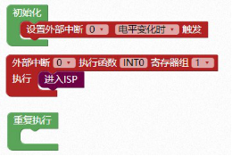

### 系统配置模块<!-- {docsify-ignore} -->

 

1. #### 系统频率设置

> 系统频率设置，在PWM、定时器、串口、EEPROM 模块中调用了这个参数。在图形化编程模板里已经默认设置为 24M，此参数，初学者不要随便修改。


 

```c
uint32 sys_clk = 24000000;	
```


2. #### 设置系统时钟


 

> 设置分频系数，此参数，初学者不要随便修改。
>

```c
#include "lib/sysclock.h"//引入头文件
sysclock_set_hir_irc(0);//内部高速时钟分频设置
sysclock_set_32k_irc(0);//内部低速时钟分频设置
sysclock_set_xosc(0);//外部时钟分频设置
```

 （STC32G）

> STC32G主板设置工作主频 PLL 分频


3. #### 初始化设置PWM最大占空比

> 设置PWM 占空比的分母，系统默认 1000，会影响 PWM 占空比的输出。此参数，初学者不要随便修改。

 

```c
#define PWM_DUTY_MAX 1000
```

> 示例：
>
> 设置最大占空比值为 1000，当设置占空比为 500 时，输出为 50%。
>
> 设置最大占空比值为 500，当设置占空比为 500 时，输出为 100%。

 

4. #### 设置程序自动进入 ISP 下载模式

> 设置程序自动进入 ISP 下载模式，在USB 下载模式场合里，配合按键中断使用

 
```c
IAP_CONTR = 0x60;
```

示例：

按下按键 KEY1，进入 ISP 下载模式


 


```c
#include <STC8HX.h>
void INT0(void) interrupt 0 using 1{
	IAP_CONTR = 0x60;
}
void setup()
{
    IT0 = 0;
    EX0 = 1;
    EA = 1;
}
void loop()
{
    
}
void main(void)
{
    setup();
    while(1){
    	loop();
	}
}

```

  

5. #### 天问 51初始化


 

当硬件设备为天问 51 开发板时，需要在初始化里添加，用来初始化天问 51 板载的 595 移位寄存器默认输出。另外关闭 RGB，因为 RGB 为单总线控制，下载时会引起 RGB 模块随机亮，影响使用体验。同时把所有端口默认设置为双向 IO 口。

```c
#include "lib/hc595.h"
#include "lib/rgb.h"
#include "lib/delay.h"
void twen_board_init()
{
    P0M1=0x00;P0M0=0x00;//双向 IO 口
    P1M1=0x00;P1M0=0x00;//双向 IO 口
    P2M1=0x00;P2M0=0x00;//双向 IO 口
    P3M1=0x00;P3M0=0x00;//双向 IO 口
    P4M1=0x00;P4M0=0x00;//双向 IO 口
    P5M1=0x00;P5M0=0x00;//双向 IO 口
    P6M1=0x00;P6M0=0x00;//双向 IO 口
    P7M1=0x00;P7M0=0x00;//双向 IO 口
    hc595_init();//HC595 初始化
    hc595_disable();//HC595 禁止点阵和数码管输出
    rgb_init();//RGB 初始化
    delay(10);
    rgb_show(0,0,0,0);//关闭 RGB
    delay(10);
}
void setup()
{
	twen_board_init();//天问 51 初始化
}
void loop()
{
    
}

void main(void)
{
    setup();
    while(1){
        loop();
    }
}
```

 

6. ####  配置 STC-LINK 无线下载器的网络


 

具体使用请查看STC-LINK 无线下载器使用说明。