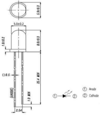
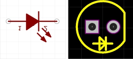
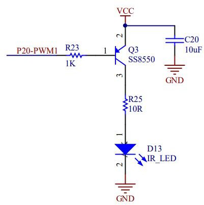
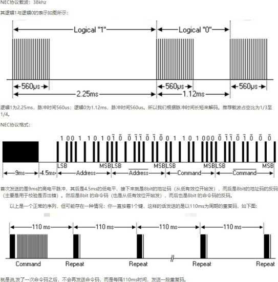
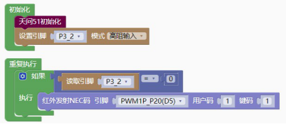

## 通讯模块<!-- {docsify-ignore} -->

### 红外发送<!-- {docsify-ignore} -->


**硬件概述**

 

>
> 红外发光二极管（IR333C-A）是一种高辐射强度的二极管，模制在一个透明的塑料封装中，峰值波长λp=940nm。
>

**引脚定义**

 

 

| 序号 | 符号 | 管脚名 | 功 能 描 述 |
| -------------- | -------------- | ---------------- | --------------------- |
| 1    | 1    | 长脚             | 正极                  |
| 2    | 2    | 短脚             | 负极                  |

**电路原理图**


 

>
> 红外通讯一般采用 38KHz 载波，所以连在有PWM 功能的引脚上。
>


1. #### 红外发送 NEC 协议的数据


 

> 其中用户码和键码对应如下 NEC 协议的 Address 和Command。
>


 

**示例代码 1**


 

> 独立按键KEY1 按下发送红外数据。
>

**调用函数代码**

> //引入头文件

```c
#include "lib/ir.h"c
```

```c
//引脚定义
#define IR_SEND_PIN P2_0 //红外发射引脚
#define IR_SEND_PIN_OUT {P2M1&=~0x01;P2M0|=0x01;} //P20 推挽输出
#define IR_SEND_PIN_INIT {P2M1|=0x01;P2M0&=~0x01;} //P20 高阻输入
#define IR_SEND_PWM PWM1P_P20

void ir_send_nec(uint8 address, uint8 command); //红外发射
```

**示例代码 1**

```c
#define PWM_DUTY_MAX 1000
//PWM 最大占空比值
#define IR_SEND_PIN P2_0
#define IR_SEND_PIN_OUT {P2M1&=~0x01;P2M0|=0x01;}//P2_0x01 推挽输出
#define IR_SEND_PIN_INIT {P2M1|=0x01;P2M0&=~0x01;}//P2_0x01 高阻输入
#define IR_SEND_PWM PWM1P_P20
#include <STC8HX.h>
uint32 sys_clk = 24000000;
//系统时钟确认
#include "lib/hc595.h"
#include "lib/rgb.h"
#include "lib/delay.h"
#include "lib/ir.h"


void twen_board_init()
{
    P0M1 = 0x00;
    P0M0 = 0x00; // 双向 IO 口
    P1M1 = 0x00;
    P1M0 = 0x00; // 双向 IO 口
    P2M1 = 0x00;
    P2M0 = 0x00; // 双向 IO 口
    P3M1 = 0x00;
    P3M0 = 0x00; // 双向 IO 口
    P4M1 = 0x00;
    P4M0 = 0x00; // 双向 IO 口
    P5M1 = 0x00;
    P5M0 = 0x00; // 双向 IO 口
    P6M1 = 0x00;
    P6M0 = 0x00; // 双向 IO 口
    P7M1 = 0x00;
    P7M0 = 0x00;     // 双向 IO 口
    hc595_init();    // HC595 初始化
    hc595_disable(); // HC595 禁止点阵和数码管输出
    rgb_init();      // RGB 初始化
    delay(10);
    rgb_show(0, 0, 0, 0); // 关闭 RGB
    delay(10);
}
void setup()
{

    twen_board_init(); // 天问 51 初始化
    P3M1 |= 0x04;
    P3M0 &= ~0x04; // 高阻输入
}
void loop()
{
    if (P3_2 == 0)
    {
        ir_send_nec(1, 1); // 红外发射 NEC 码
    }
}
void main(void)
{
    setup();
    while (1)
    {
        loop();
    }
}

```


