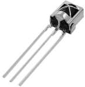
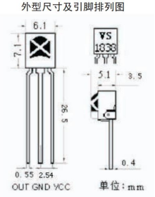
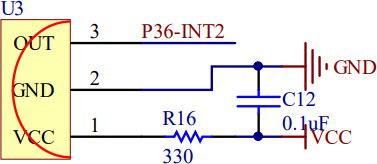
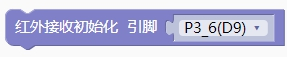
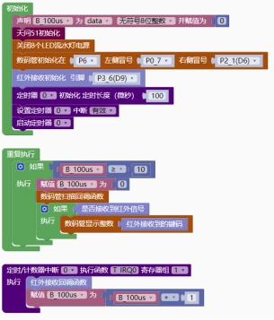

### 红外接收<!-- {docsify-ignore} -->

 

**硬件概述**


 

 

> 内置专用 IC，自动过滤 38KHz 载波，输出红外信号。
>

**引脚定义**


 


| 序号 | 符号 | 管脚名 | 功 能 描 述 |
| -------------- | -------------- | ---------------- | --------------------- |
| 1    | VCC  | 电源脚           | 供电                  |
| 2    | GNG  | 接地脚           | 供电                  |
| 3    | OUT  | 信号脚           | 输出红外信号          |

**电路原理图**


 


> 红外库默认使用NEC 红外协议。
>

1. #### 红外接收初始化

 


2. #### 红外接收回调函数

 


3. #### 判断是否接收到红外信号

 


4. #### 获取红外协议的用户码

 


5. #### 获取红外协议的键码

 

 

**示例代码 1**

> 数码管显示接收到的红外键码
>


 

**调用函数代码**

> //引入头文件

```c
#include "lib/ir.h"
```

> //引脚定义

```c
//引脚定义
#define IR_REC_PIN P3_6
#define IR_REC_PIN_MODE {P3M1|=0x40;P3M0&=~0x40;} //P36 输入
```

**示例代码 1**

```c
#define NIXIETUBE_PORT P6
#define NIXIETUBE_PORT_MODE {P6M1=0x00;P6M0=0xff;}//推挽输出
#define NIXIETUBE_LEFT_COLON_PIN P0_7//左侧数码管冒号
#define NIXIETUBE_LEFT_COLON_PIN_MODE {P0M1&=~0x80;P0M0|=0x80;}//推挽输出
#define NIXIETUBE_RIGHT_COLON_PIN P2_1//右侧数码管冒号
#define NIXIETUBE_RIGHT_COLON_PIN_MODE {P2M1&=~0x02;P2M0|=0x02;}//推挽输出
#define PWM_DUTY_MAX 1000
//PWM 最大占空比值
#define IR_REC_PIN P3_6
#define IR_REC_PIN_MODE {P3M1|=0x40;P3M0&=~0x40;}//P3_6 高阻输入
#include <STC8HX.h>
uint32 sys_clk = 24000000;
//系统时钟确认
#include "lib/hc595.h"
#include "lib/rgb.h"
#include "lib/delay.h"
#include "lib/led8.h"
#include "lib/nixietube.h"
#include "lib/ir.h"

uint8 B_100us = 0;

void twen_board_init()
{
    P0M1 = 0x00;
    P0M0 = 0x00; // 双向 IO 口
    P1M1 = 0x00;
    P1M0 = 0x00; // 双向 IO 口
    P2M1 = 0x00;
    P2M0 = 0x00; // 双向 IO 口
    P3M1 = 0x00;
    P3M0 = 0x00; // 双向 IO 口
    P4M1 = 0x00;
    P4M0 = 0x00; // 双向 IO 口
    P5M1 = 0x00;
    P5M0 = 0x00; // 双向 IO 口
    P6M1 = 0x00;
    P6M0 = 0x00; // 双向 IO 口
    P7M1 = 0x00;
    P7M0 = 0x00;     // 双向 IO 口
    hc595_init();    // HC595 初始化
    hc595_disable(); // HC595 禁止点阵和数码管输出
    rgb_init();      // RGB 初始化
    delay(10);
    rgb_show(0, 0, 0, 0); // 关闭 RGB
    delay(10);
}

void Timer0Init(void) // 100 微秒@24.000MHz
{
    TMOD |= 0x00; // 模式 0
    TL0 = 0x37;   // 设定定时初值
    TH0 = 0xff;   // 设定定时初值
}
void T_IRQ0(void) interrupt 1 using 1
{
    ir_rec_callback(); // 红外接收回调函数
    B_100us = B_100us + 1;
}
void setup()
{
    twen_board_init(); // 天问 51 初始化
    led8_disable();    // 关闭 8 个 LED 流水灯电源
    nix_init();        // 数码管初始化
    ir_rx_init();      // 红外接收初始化
    Timer0Init();
    EA = 1;  // 控制总中断
    ET0 = 1; // 控制定时器中断
    TR0 = 1; // 启动定时器
}
void loop()
{
    if (B_100us >= 10)
    {
        B_100us = 0;
        nix_scan_callback(); // 数码管扫描回调函数
        if (ir_rx_available())
        {
            nix_display_num((ir_rx_ircode())); // 数码管显示整数
        }
    }
}
void main(void)
{
    setup();
    while (1)
    {
        loop();
    }
}
```

