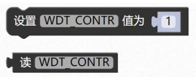
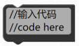
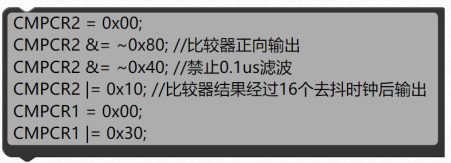
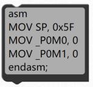

### 读写寄存器模块 <!-- {docsify-ignore} -->


> 平台图形化模块只是提供了常用的功能，一些特殊外设和寄存器没有提供，如果还是想 用图形化编程，可以使用如下模块，可以自己设置寄存器，也可以嵌入 C 语言代码或者直接 好好搭搭在线 haohaodada.com 66 嵌入汇编。 

1. #### 读写寄存器

 


> 一些特殊寄存器，没做对应的图形块，可以用这个模块手动添加。 


2. #### 宏定义 

 

>    等效于
>

```c
#define MYDEFINE P0_0 
```

   


3. #### 嵌入代码 

 


> 示例 1： 
> 嵌入 C 语言代码。 

 


> 示例 2：
> 嵌入汇编语言代码，开头需要 asm 关键字，结尾需要 endasm。

 