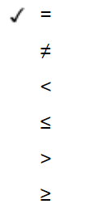
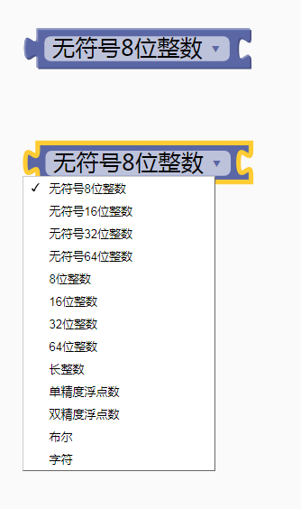
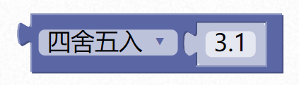
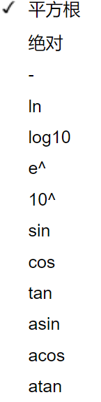

### 数学与逻辑模块  <!-- {docsify-ignore} -->

1. #### 数字模块

    数值大小里面可以自己填写。

     

    > 作为逻辑模块使用时，0代表false，其他值代表true。

2. #### 常用数学运算

    包含加、减、乘、除、幂，两个输入框放入变量输出块或者直接修改数字，运算结果会返回给输入块。

     

    示例 1：

    变量 a+1。

     

    示例 2：
    变量 x+y。

     

3. #### 位操作

    包含与、或、异或、右移、左移。

     

    示例 1：

    变量 a>>1 右移 1 位。

     

4. #### 位取反

     

    示例 1：

    变量 a 按位取反。

     

5. #### 数字比较

    包含等于、不等于、小于、小于等于、大于、大于等于。

     

     

    示例 1：

    比较变量 x 和 y 是否相等。

     

    示例 2：

    比较变量 x 是否等于 0。

     

6. #### 逻辑比较

   包含逻辑且（&&）、或（||）。

    

   示例 1：

   当 a>0 并且 a<5 时，条件才成立返回真，否则返回假。

    

   ```c
   (a>0) && (a<5)
   ```

7. #### 逻辑非

     

    示例 1：

    变量 a，逻辑取反。

    ```c
    !a
    ```


8. #### 强制类型转换

 

> 把常量与变量进行强制类型转换，通过下拉菜单改变数据类型。
>


 

 

> 示例 1：将变量 a 强制转换为无符号的 8 位数
>


 

 

9. #### 初始化随机数种子

 

> 通过随机数方式设定随机数的集合，使用时随机数的出现顺序也会随机变化。一般会结合 ADC 采用悬空引脚来使用，做到每次开机后随机数的出现顺序是不一样的。
>


 

 


10. #### 获取指定区间内的随机数

    

   ```c
   //返回指定区间内的随机数，不包含区间最大值。
   random(1, 101) //返回 1------100 之间的随机数。
   ```

11. #### 取余数

     

    示例 1：

    返回变量除于 2 的余数，只有 0，1 两种，可以用来判断奇偶数。

     

12. #### 取舍取整函数

    包含四舍五入、向上取整，向下取整。

     

    ```c
    round(3.1)
    ```

    返回四舍五入后的数。

13. #### 复杂数学运算

      

    包含平方根、绝对值、负数、对数、幂、三角函数。

      

     ```c
     sqrt(9) //平方根
     abs(9) //绝对值
     -9 // 负数
     log(9) //ln
     log10(9) //log10
     exp(9) //e^
     pow(10,9) //10^9
     sin(9 / 180.0 * PI) //sin
     cos(9 / 180.0 * PI) //cos
     tan(9 / 180.0 * PI) //tan
     asin(9) / PI * 180 //asin
     acos(9) / PI * 180 //acos
     atan(9) / PI * 180 //atan
     ```

14. #### 映射

      返回指定比例系数和范围的数据。常用在给数据的范围等比例放大或者缩小。
       

     ```c
     map(,1,100,1,1000)
     ```
      内部实现代码

     ```c
     long map(long x, long in_min, long in_max, long out_min, long out_max)
     {
       return (x - in_min) * (out_max - out_min) / (in_max - in_min) + out_min;
     }
     ```

     > 示例 1：
     >
     >
     > 变量 a 的初始范围为 1 到 100，等比例放大 10 倍。
     >
     > 即 a=1，返回 1；
     >
     > a=50，返回 500；
     >
     > a=100，返回 1000；

      