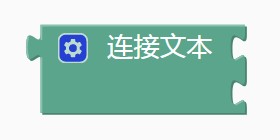
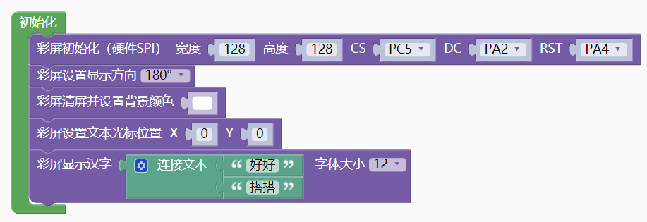
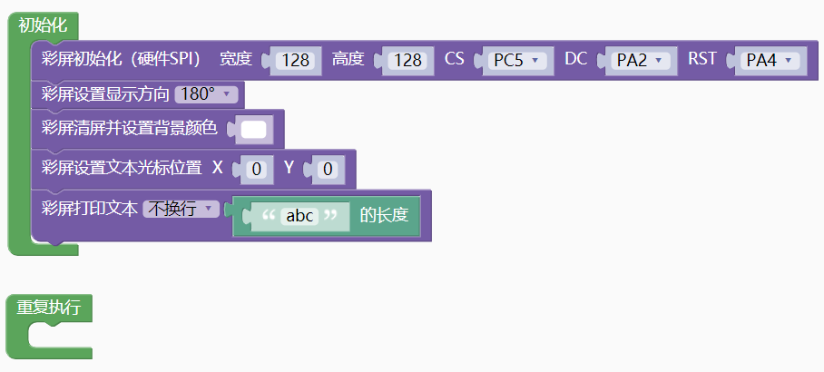
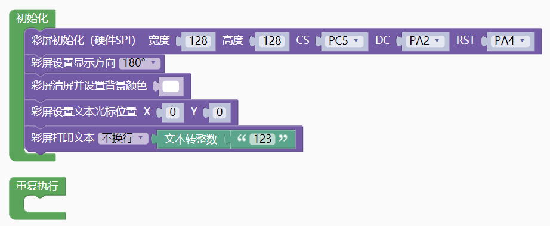
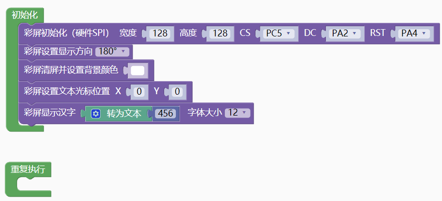

### 文本模块  <!-- {docsify-ignore} -->

1. #### 字符串

    

   示例 1：

   定义"hello world"字符串

    

   ```c
   "hello world"
   ```

2. #### 字符

    

   示例 1：

   定义'A'字符

    

   ```c
   'A'
   ```

   定义'\n'换行符

    

   ```c
   '\n'
   ```

3. #### 连接文本或转文本

    

   示例 1：
   

   ```cpp
   #include <CH32V103.h>
   #include "myLib/CH32V_ST7735S.h"
   
   SPITFT spi_tft(128,128,PC5,PA2,PA4);
   
   int main(void)
   {
     CH32_Init();
     spi_tft.init();
     spi_tft.set_direction(2);
     spi_tft.clear((0xFFFF));
     spi_tft.set_cursor(0,0);
     spi_tft.draw_hanzi_12((String("好好") + String("搭搭")));
     while(1){
       
     }
     return 1;
   }
   ```
   彩屏显示"好好搭搭"。

4. #### 获取字符串长度

    

   示例 1：

    

   ```cpp
   #include <CH32V103.h>
   #include "myLib/CH32V_ST7735S.h"
   #include <string.h>
   
   SPITFT spi_tft(128,128,PC5,PA2,PA4);
   
   int main(void)
   {
     CH32_Init();
     spi_tft.init();
     spi_tft.set_direction(2);
     spi_tft.clear((0xFFFF));
     spi_tft.set_cursor(0,0);
     spi_tft.print((String("abc").length()));
     while(1){
   		
     }
     return 1;
   }
   ```

   彩屏显示 3

5. #### 文本转整数

    

   示例 1：

    

   ```cpp
   #include <CH32V103.h>
   #include "myLib/CH32V_ST7735S.h"
   
   SPITFT spi_tft(128,128,PC5,PA2,PA4);
   
   int main(void)
   {
     CH32_Init();
     spi_tft.init();
     spi_tft.set_direction(2);
     spi_tft.clear((0xFFFF));
     spi_tft.set_cursor(0,0);
     spi_tft.print((String("123").toInt()));
     while(1){
   		
     }
     return 1;
   }
   ```

   彩屏显示 123

6. #### 转文本

    

   示例 1：

    

   ```cpp
   #include <CH32V103.h>
   #include "myLib/CH32V_ST7735S.h"
   
   SPITFT spi_tft(128,128,PC5,PA2,PA4);
   
   int main(void)
   {
     CH32_Init();
     spi_tft.init();
     spi_tft.set_direction(2);
     spi_tft.clear((0xFFFF));
     spi_tft.set_cursor(0,0);
     spi_tft.draw_hanzi_12((String(456)));
     while(1){
       
     }
     return 1;
   }
   ```

   彩屏显示 456。


7. #### 查找文本位置

    

   

8. #### 提取文本

    