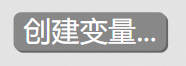
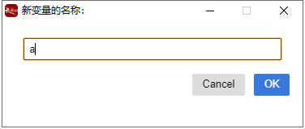
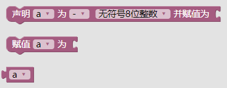
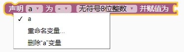
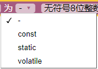
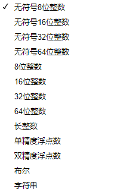
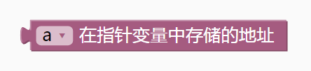
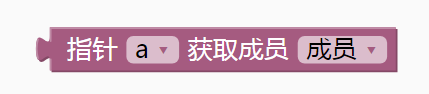

### 变量模块  <!-- {docsify-ignore} -->

1. #### 创建变量

   

   > 图形化模块支持变量名为中文，系统会自动转义为英文，但是可读性差，一般不建议用中文。
   >
   > 

    

   

   > 变量栏目默认没有变量，需要点击灰色按钮创建。

   

    

   

   > 在弹出框中输入变量名，点击确定。再次打开变量栏目出现如下图形块：

   


    

   

2. #### 变量声明

   

   > 第一个选项里，可以再次重命名或者删除变量。

   

    

   

   > 第二个选项里，可以设置变量前缀

   

    

   

   > 第三个选项里，选择变量的类型

   

    

   ```cpp
   uint8_t; // 8 bits
   uint16_t; // 16 bits
   uint32_t; // 32 bits
   uint64_t; // 64 bits
   int8_t; // 8 bits
   int16_t; // 16 bits
   int32_t; // 32 bits
   int64_t; // 64 bits
   long;
   float;
   double;
   bool;
   String;
   ```

3. #### 变量赋值

   

    

   

4. #### 返回指针变量中存储的地址

   

    

   

5. #### 返回指针中特定成员的值

   

    

   

6. #### 获取变量值

    

   