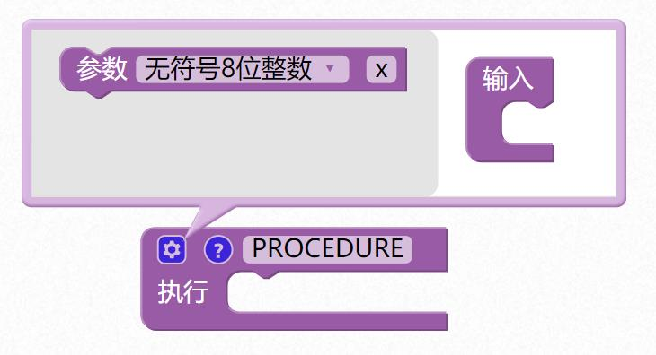
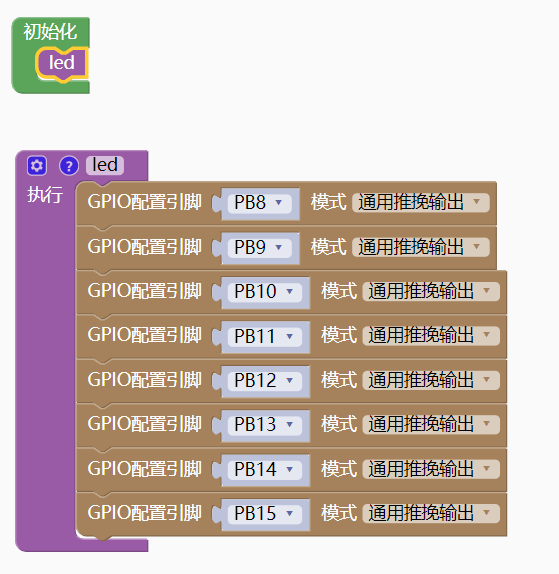
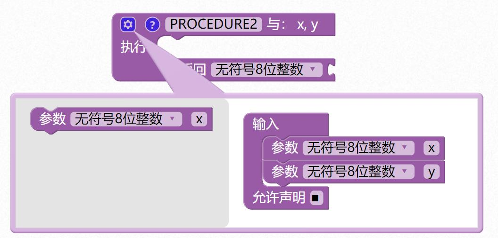
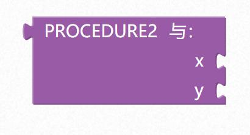
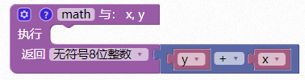
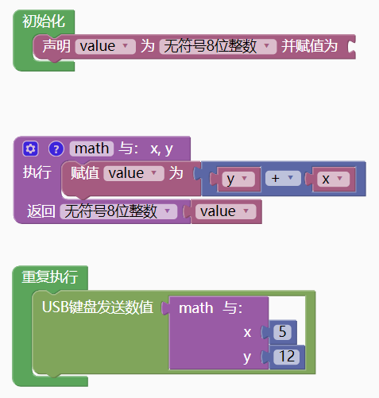
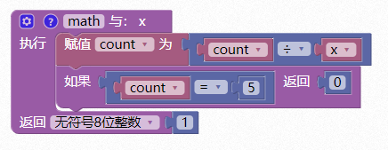

### 函数模块  <!-- {docsify-ignore} -->

1. #### 定义无返回值函数

    

   点击蓝色小齿轮，可以添加输入参数，函数名可以自己命名，建议不要用中文。

    

   函数块使用好了后，在函数栏目里会自动出现对应的执行函数块。

    

   示例 1：

   把多个 LED 操作归纳到 led 函数里，让主程序可读性增强。

    

2. #### 定义有返回值函数

   如需要输入参数，操作和定义无返回值函数一样。

    

    

   如果需要在函数执行过程中间范围，可以添加如果返回模块。

    

    

   示例 1：

   定义数学函数，返回 x+y 运算结果值

    

   示例 2：

   上述程序也可以写成这样

    

   示例 3：

   在函数内部执行过程中判断，条件成立直接返回，不用等全部执行完后再返回。

    