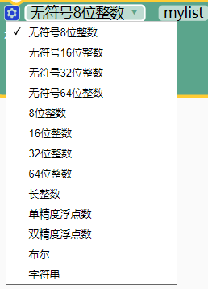
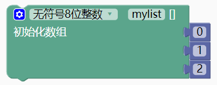

### 数组模块  <!-- {docsify-ignore} -->

1. #### 定义无返回值函数定义无返回值函数创建数组方式1

    

   数组类型根据情况选择。

    

   数组初始数据可以通过蓝色小齿轮增加

    

   示例 1：

   定义一个 8 位数组，数组名为 mylist，数组初始内容为 0，1，2

    

   ```c
   uint8_t mylist[]={0, 1, 2};
   ```

2. #### 创建数组方式2

   前面一种方式，拖动起来比较麻烦，可以用这种方式

    

   示例 1：

   ```c
   uint8_t mylist[3]={0,1,2};
   ```

3. #### 创建数组方式3

   只定义长度，内容为空。

    

4. #### 获取数组地址

     

5. #### 获取数组长度

     

6. #### 获取数组指定项目数据

     

7. #### 给数组指定项目赋值

     

8. #### 创建二维数组方式1

     

9. #### 创建二维数组方式2

     

10. #### 给二维数组的指定行列赋值

     

11. #### 获取二维数组的指定行列数据

      

12. #### 获取行/列数

      

